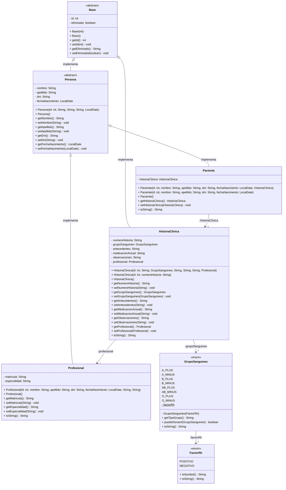
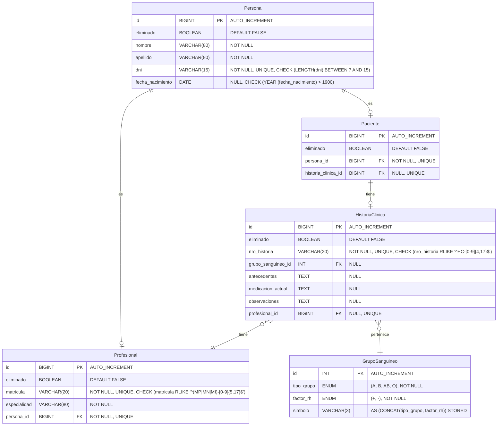

# Sistema de Gestión de Pacientes e Historias Clínicas

      [](https://github.com/Gerolupo12/paciente-historia-cliente)

## Integrantes

Este proyecto fue desarrollado de manera colaborativa por el siguiente equipo:

- **Lagos, Alejandro** - [GitHub](https://github.com/Alejandrovans)
- **Lahoz, Cristian** - [GitHub](https://github.com/m415x)
- **Maldonado, Ariana** - [GitHub](https://github.com/AriMaldo19)
- **Ramallo, Gerónimo** - [GitHub](https://github.com/Gerolupo12)

## Descripción del Proyecto

Sistema desarrollado en Java que gestiona la relación unidireccional 1→1 entre **Pacientes** y sus **Historias Clínicas**. Implementa el patrón DAO, transacciones con commit/rollback, y un menú de consola para operaciones CRUD completas.

### Dominio Elegido: Paciente → HistoriaClínica

- **Paciente**: Información personal y datos de identificación
- **HistoriaClínica**: Datos médicos y antecedentes del paciente

## Estructura del Proyecto

```plaintext
paciente-historia-cliente
├── anexos
│   ├── chat_ia_db_i.pdf
│   └── chat_ia_prog_ii.pdf
├── informes
│   ├── informe_db_i.md
│   └── informe_prog_ii.md
├── sql
│   ├── carga_masiva_datos.sql
│   ├── consultas_complejas.sql
│   ├── sentencias_creacion.sql
│   └── validacion_constraints.sql
├── src
│   ├── config
│   │   ├── DatabaseConnection.java
│   │   └── TransactionManager.java
│   ├── dao
│   │   ├── GenericDAO.java
│   │   ├── HistoriaClinicaDAO.java
│   │   └── PacienteDAO.java
│   ├── main
│   │   ├── AppMenu.java
│   │   ├── Main.java
│   │   └── TestConnection.java
│   ├── models
│   │   ├── Base.java
│   │   ├── FactorRh.java
│   │   ├── GrupoSanguineo.java
│   │   ├── HistoriaClinica.java
│   │   ├── Paciente.java
│   │   ├── Persona.java
│   │   ├── Profesional.java
│   │   └── ClasePrincipalParaPruebas.java
│   └── service
│       ├── GenericService.java
│       ├── HistoriaClinicaService.java
│       └── PacienteService.java
└── test
```

## Diagrama UML



<!-- ## Instalación y Configuración -->

<!-- ## Uso de la Aplicación -->

## Funcionalidades Implementadas

- Relación 1→1 unidireccional (Paciente → HistoriaClinica)
- CRUD completo con baja lógica
- Transacciones con commit/rollback
- Validaciones de entrada robustas
- Manejo de excepciones en todas las capas
- Búsquedas por campos clave (DNI, número de historia)
- Arquitectura en capas (DAO/Service/Menu)

## Diagrama Entidad Relación de la Base de Datos



## Decisiones de Diseño

El diseño de la base de datos y de la arquitectura de la aplicación se guió por principios de normalización, integridad, escalabilidad y consistencia entre el modelo relacional y el modelo de objetos en Java. A continuación, se detallan las decisiones más importantes tomadas durante el proyecto.

### 1. Abstracción de la Entidad `Persona` para Cumplir la 3FN

La decisión de diseño más importante fue la creación de una entidad `Persona` para centralizar los atributos comunes que originalmente se encontraban duplicados en `Paciente` y `Profesional`.

- **Problema Detectado:** En el modelo inicial, tanto `Paciente` como `Profesional` contenían campos como `nombre`, `apellido`, `dni` y `fecha_nacimiento`. Esto generaba una dependencia transitiva (`id → dni → nombre, apellido`), lo cual es una violación de la Tercera Forma Normal (3FN), tal como se documentó en el informe.
- **Solución Adoptada:** Se extrajeron los atributos personales a una tabla `Persona`. Las tablas `Paciente` y `Profesional` pasaron a ser "roles" que se vinculan a una `Persona` a través de una clave foránea (`persona_id`).
- **Beneficios:**
  - **Eliminación de Redundancia:** Se evita almacenar la misma información personal en múltiples lugares.
  - **Garantía de Integridad:** Se asegura que los datos de una persona sean consistentes, sin importar los roles que desempeñe en el sistema.
  - **Alta Escalabilidad:** El modelo ahora puede crecer fácilmente para incluir nuevos roles (ej. `Administrativo`, `Enfermero`) sin necesidad de duplicar datos, simplemente creando una nueva tabla de rol que se vincule a `Persona`.

### 2. Implementación de la Relación 1→1 Unidireccional

Para cumplir con el requisito central de la materia Programación II de una relación 1→1 unidireccional `Paciente → HistoriaClinica`, se tomó una decisión específica a nivel de base de datos.

- **Implementación:** La relación se implementó en la tabla `Paciente` mediante una clave foránea (`historia_clinica_id`) que apunta a `HistoriaClinica` y, crucialmente, tiene una restricción `UNIQUE`.
- **Justificación:**
  - El `FOREIGN KEY` establece el enlace entre las dos entidades.
  - El `UNIQUE` garantiza que un registro de `HistoriaClinica` solo pueda ser asociado a un único `Paciente`, cumpliendo así la cardinalidad 1 a 1.
  - Se permitió que esta clave foránea sea `NULL`, aportando flexibilidad para poder registrar un paciente antes de que su historia clínica sea creada.

### 3. `GrupoSanguineo`: Tabla en la Base de Datos vs. `Enum` en Java

Se tomó una decisión consciente de modelar el grupo sanguíneo de dos maneras distintas en cada capa, optimizando para el contexto de cada una.

- **En la Base de Datos (Tabla):** Se creó una tabla maestra `GrupoSanguineo`. Esto responde a los principios de normalización, creando una única fuente de verdad para los tipos de sangre y evitando el uso de campos de texto libre. Permite a futuro agregar más información (ej. compatibilidades) sin alterar el esquema.
- **En Java (`Enum`):** En el código Java, se optó por un `Enum`. Esta decisión prioriza la seguridad de tipos y la simplicidad. El `Enum` asegura que solo se puedan usar valores válidos en tiempo de compilación, previene errores de programación y hace el código más legible y mantenible, sin la necesidad de crear una clase, un DAO y un servicio adicional para una entidad cuyos valores son estáticos y universalmente conocidos.

### 4. Incorporación de la Entidad `Profesional`

Aunque la consigna mínima requería solo dos entidades, se decidió incorporar la entidad `Profesional` para enriquecer el dominio y hacerlo más realista.

- **Justificación:** Permite asociar una `HistoriaClinica` a un profesional tratante. Esto no solo aporta un dato contextual valioso, sino que habilita futuras funcionalidades, como consultas para ver todos los pacientes de un médico o estadísticas por especialidad, como se demuestra en las consultas analíticas del informe.

### 5. Uso de Bajas Lógicas (`eliminado`)

Siguiendo las buenas prácticas y los requisitos de las consignas, todas las tablas del modelo incluyen un campo booleano `eliminado`.

- **Justificación:** En lugar de borrar físicamente los registros (`DELETE`), se realiza una baja lógica (`UPDATE ... SET eliminado = TRUE`). Esta estrategia es fundamental en sistemas de gestión de datos por varias razones:
  - **Preservación del Historial:** Mantiene un registro histórico de todas las entidades, crucial para auditorías o análisis futuros.
  - **Integridad Referencial:** Evita problemas de registros huérfanos que podrían ocurrir si se elimina una `Persona` o `HistoriaClinica` a la que otros registros todavía podrían referenciar indirectamente.
  - **Recuperación de Datos:** Permite "restaurar" un registro de manera sencilla.

## Informes

- [x] [Base de Datos I](./informes/informe_db_i.md)
- [x] [Programación II](./informes/informe_prog_ii.md)
