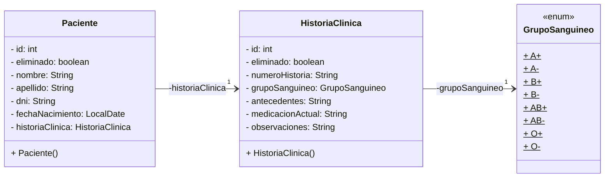
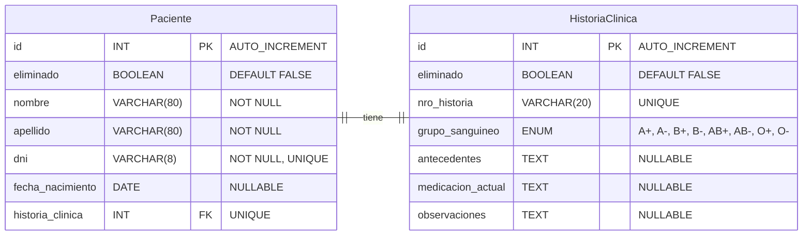

# Sistema de Gestión de Pacientes e Historias Clínicas

      [](https://github.com/Gerolupo12/paciente-historia-cliente)

## Integrantes del Grupo

- **Ariana Maldonado** - [GitHub](https://github.com/AriMaldo19)
- **Gerónimo Ramallo** - [GitHub](https://github.com/Gerolupo12)
- **Alejandro Lagos** - [GitHub](https://github.com/Alejandrovans)
- **Cristian Lahoz** - [GitHub](https://github.com/m415x)

## Descripción del Proyecto

Sistema desarrollado en Java que gestiona la relación unidireccional 1-->1 entre **Pacientes** y sus **Historias Clínicas**. Implementa el patrón DAO, transacciones con commit/rollback, y un menú de consola para operaciones CRUD completas.

### Dominio Elegido: Paciente --> HistoriaClínica

- **Paciente**: Información personal y datos de identificación
- **HistoriaClínica**: Datos médicos y antecedentes del paciente

## Estructura del Proyecto

```plaintext
    paciente-historia-cliente/
    ├── src/
    │   └── main/
    │       ├── java/
    │       │   ├── config/
    │       │   │   └── DatabaseConnection.java
    │       │   ├── entities/
    │       │   │   ├── Paciente.java
    │       │   │   └── HistoriaClinica.java
    │       │   ├── dao/
    │       │   ├── service/
    │       │   └── main/
    │       │       └── AppMenu.java
    │       └── resources/
    ├── sql/
    └── docs/
```

## Diagrama UML



<!-- ## Requisitos del Sistema -->

<!-- ## Instalación y Configuración -->

<!-- ## Uso de la Aplicación -->

<!-- ## Scripts SQL Incluidos -->

## Funcionalidades Implementadas

- Relación 1-->1 unidireccional (Paciente --> HistoriaClinica)
- CRUD completo con baja lógica
- Transacciones con commit/rollback
- Validaciones de entrada robustas
- Manejo de excepciones en todas las capas
- Búsquedas por campos clave (DNI, número de historia)
- Arquitectura en capas (DAO/Service/Menu)

## Estructura de la Base de Datos

### Tabla: `Paciente`

| Campo            | Tipo MySQL  | Restricciones               | Notas                              |
| ---------------- | ----------- | --------------------------- | ---------------------------------- |
| id               | INT         | PRIMARY KEY, AUTO_INCREMENT | Clave primaria                     |
| eliminado        | BOOLEAN     | DEFAULT FALSE               | Baja lógica                        |
| nombre           | VARCHAR(80) | NOT NULL                    | Máximo 80 caracteres               |
| apellido         | VARCHAR(80) | NOT NULL                    | Máximo 80 caracteres               |
| dni              | VARCHAR(8)  | NOT NULL, UNIQUE            | Máximo 8 caracteres, único         |
| fecha_nacimiento | DATE        | NULLABLE                    | Tipo fecha                         |
| historia_clinica | INT         | FOREIGN KEY, UNIQUE         | Relación 1-->1 con HistoriaClinica |

### Tabla: `HistoriaClinica`

| Campo             | Tipo MySQL                                             | Restricciones               | Notas                       |
| ----------------- | ------------------------------------------------------ | --------------------------- | --------------------------- |
| id                | INT                                                    | PRIMARY KEY, AUTO_INCREMENT | Clave primaria              |
| eliminado         | BOOLEAN                                                | DEFAULT FALSE               | Baja lógica                 |
| nro_historia      | VARCHAR(20)                                            | UNIQUE                      | Máximo 20 caracteres, único |
| grupo_sanguineo   | ENUM('A+', 'A-', 'B+', 'B-', 'AB+', 'AB-', 'O+', 'O-') | NULLABLE                    | Enumeración                 |
| antecedentes      | TEXT                                                   | NULLABLE                    | Texto largo                 |
| medicacion_actual | TEXT                                                   | NULLABLE                    | Texto largo                 |
| observaciones     | TEXT                                                   | NULLABLE                    | Texto largo                 |

## Diagrama ER



## Video Demostración

<!-- [Ver video de demostración](#) (10-15 minutos) -->

## Licencia

Este proyecto está bajo la Licencia MIT. Ver el archivo [`LICENSE`](LICENSE) para más detalles.
