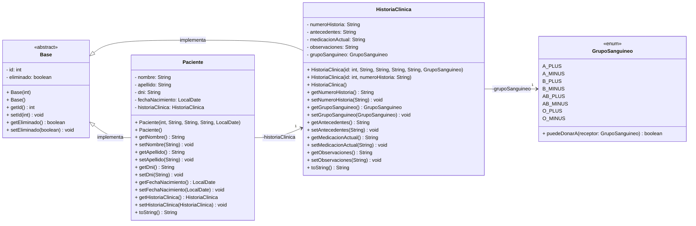
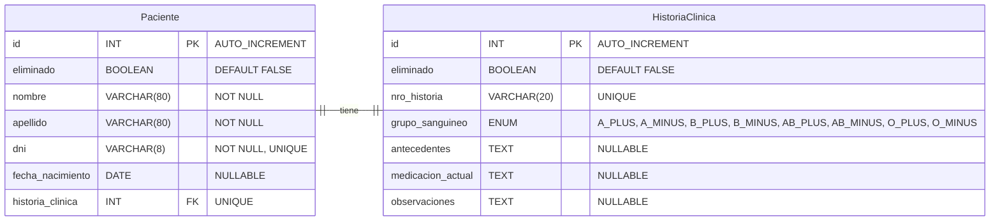

# Sistema de Gestión de Pacientes e Historias Clínicas

      [](https://github.com/Gerolupo12/paciente-historia-cliente)

## Integrantes del Grupo

- **Ariana Maldonado** - [GitHub](https://github.com/AriMaldo19)
- **Gerónimo Ramallo** - [GitHub](https://github.com/Gerolupo12)
- **Alejandro Lagos** - [GitHub](https://github.com/Alejandrovans)
- **Cristian Lahoz** - [GitHub](https://github.com/m415x)

## Descripción del Proyecto

Sistema desarrollado en Java que gestiona la relación unidireccional 1-->1 entre **Pacientes** y sus **Historias Clínicas**. Implementa el patrón DAO, transacciones con commit/rollback, y un menú de consola para operaciones CRUD completas.

### Dominio Elegido: Paciente --> HistoriaClínica

- **Paciente**: Información personal y datos de identificación
- **HistoriaClínica**: Datos médicos y antecedentes del paciente

## Estructura del Proyecto

```plaintext
    paciente-historia-cliente/
    ├── sql
    │   └── schema.sql
    ├── src
    │   ├── config
    │   │   ├── DatabaseConnection.java
    │   │   └── TransactionManager.java
    │   ├── dao
    │   │   ├── GenericDAO.java
    │   │   ├── HistoriaClinicaDAO.java
    │   │   └── PacienteDAO.java
    │   ├── main
    │   │   ├── AppMenu.java
    │   │   ├── Main.java
    │   │   ├── NewMain.java
    │   │   └── TestConnection.java
    │   ├── models
    │   │   ├── Base.java
    │   │   ├── GrupoSanguineo.java
    │   │   ├── HistoriaClinica.java
    │   │   └── Paciente.java
    │   └── service
    │       ├── GenericService.java
    │       ├── HistoriaClinicaService.java
    │       └── PacienteService.java
    └── test
```

## Diagrama UML



<!-- ## Requisitos del Sistema -->

<!-- ## Instalación y Configuración -->

<!-- ## Uso de la Aplicación -->

## Funcionalidades Implementadas

- Relación 1-->1 unidireccional (Paciente --> HistoriaClinica)
- CRUD completo con baja lógica
- Transacciones con commit/rollback
- Validaciones de entrada robustas
- Manejo de excepciones en todas las capas
- Búsquedas por campos clave (DNI, número de historia)
- Arquitectura en capas (DAO/Service/Menu)

## Estructura de la Base de Datos

### Tabla: `Paciente`

| Campo            | Tipo MySQL  | Restricciones               |
| ---------------- | ----------- | --------------------------- |
| id               | INT         | PRIMARY KEY, AUTO_INCREMENT |
| eliminado        | BOOLEAN     | DEFAULT FALSE               |
| nombre           | VARCHAR(80) | NOT NULL                    |
| apellido         | VARCHAR(80) | NOT NULL                    |
| dni              | VARCHAR(8)  | NOT NULL, UNIQUE            |
| fecha_nacimiento | DATE        | NULLABLE                    |
| historia_clinica | INT         | FOREIGN KEY, UNIQUE         |

### Tabla: `HistoriaClinica`

| Campo             | Tipo MySQL                                                                                | Restricciones               |
| ----------------- | ----------------------------------------------------------------------------------------- | --------------------------- |
| id                | INT                                                                                       | PRIMARY KEY, AUTO_INCREMENT |
| eliminado         | BOOLEAN                                                                                   | DEFAULT FALSE               |
| nro_historia      | VARCHAR(20)                                                                               | UNIQUE                      |
| grupo_sanguineo   | ENUM('A_PLUS','A_MINUS', 'B_PLUS', 'B_MINUS', 'AB_PLUS', 'AB_MINUS', 'O_PLUS', 'O_MINUS') | NULLABLE                    |
| antecedentes      | TEXT                                                                                      | NULLABLE                    |
| medicacion_actual | TEXT                                                                                      | NULLABLE                    |
| observaciones     | TEXT                                                                                      | NULLABLE                    |

## Diagrama ER



## Video Demostración

<!-- [Ver video de demostración](#) (10-15 minutos) -->

## Licencia

Este proyecto está bajo la Licencia MIT. Ver el archivo [`LICENSE`](LICENSE) para más detalles.
