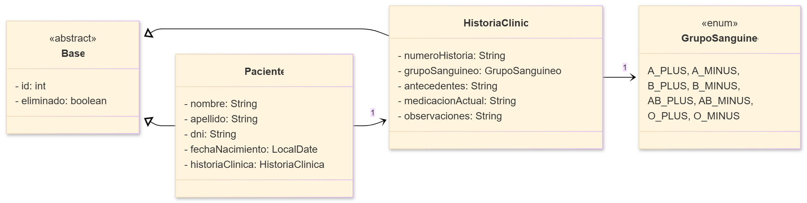

# Sistema de Gestión de Pacientes e Historias Clínicas

       [](https://github.com/Gerolupo12/paciente-historia-cliente)

## Trabajo Práctico Integrador - Programación 2

### Descripción del Proyecto

Sistema desarrollado en Java para el Trabajo Práctico Integrador (TPI) de Programación II, cuyo objetivo es demostrar el dominio de los conceptos de **Programación Orientada a Objetos**, **Persistencia de Datos con JDBC**, y **Arquitectura en Capas**. El sistema gestiona la relación unidireccional 1→1 entre **Pacientes** y sus **Historias Clínicas**, aplicando buenas prácticas de diseño, manejo de excepciones, validaciones y transacciones seguras.

### Objetivos Académicos

- Aplicar **arquitectura en capas** (Presentación / Servicio / DAO / Modelo).
- Implementar **principios SOLID** y separación de responsabilidades.
- Desarrollar persistencia con **JDBC** + **MySQL** usando **DAO Pattern**.
- Incorporar **validaciones en distintos niveles**.
- Implementar baja lógica (**Soft Delete**) y manejo robusto de excepciones.
- Utilizar **interfaces genéricas** (GenericDAO, GenericService).
- Diseñar y documentar un sistema con **estilo profesional** y **diagramas UML/ER**.

### Dominio Elegido: Paciente → HistoriaClínica

- **Paciente**: Representa a una persona bajo atención médica. Contiene información personal y datos de identificación.
- **HistoriaClínica**: Almacena la información médica y antecedentes del paciente.
- **Relación 1→1 unidireccional**: un Paciente tiene exactamente una Historia Clínica (opcional hasta ser creada y asignada).

### Arquitectura del Proyecto

```plaintext
paciente-historia-cliente
├── anexos                     # archivos adicionales para el proyecto
├── bin                        # archivos compilados (ejecutables)
├── build                      # archivos de compilación
├── gradle                     # scripts de compilación
├── informes                   # informes técnicos del proyecto
├── sql                        # scripts SQL
├── src                        # código fuente del proyecto
│   └── main                   # código fuente principal
│       ├── java               # paquetes Java
│       │   ├── config         # configuración de conexión y transacciones
│       │   ├── dao            # acceso a datos (JDBC)
│       │   ├── exceptions     # excepciones personalizadas
│       │   ├── main           # punto de entrada de la aplicación
│       │   ├── models         # entidades del dominio
│       │   ├── service        # lógica de negocio y validaciones
│       │   ├── test           # pruebas manuales
│       │   └── views          # capa de presentación (menús por entidad)
│       └── resources          # archivos de configuración
├── .gitignore                 ← archivos ignorados por Git
├── build.gradle               ← script de compilación
├── gradle.properties          ← propiedades de Gradle
├── gradlew                    ← script de ejecución en Linux / macOS
├── gradlew.bat                ← script de ejecución en Windows
├── HISTORIAS_DE_USUARIO.md    ← historias de usuario del proyecto
├── README.md                  ← archivo de lectura inicial (este archivo)
|── settings.gradle            ← archivo de configuración de Gradle
├── setup-db.ps1               ← script de configuración de BD para Windows
└── setup-db.sh                ← script de configuración de BD para Linux/macOS
```

### Diagrama UML (Modelo de Dominio)



### Tecnologías y Herramientas

| Componente                    | Descripción                  |
| ----------------------------- | ---------------------------- |
| **Java JDK 21+**              | Lenguaje principal           |
| **MySQL 8.4+**                | Base de datos relacional     |
| **JDBC (Driver Connector/J)** | Persistencia y consultas SQL |
| **Gradle 8+**                 | Herramienta de build         |
| **NetBeans / IntelliJ IDEA**  | IDE de desarrollo opcional   |
| **Git & GitHub**              | Control de versiones         |

### Funcionalidades Principales

- CRUD completo para Pacientes y Historias Clínicas
- Relación 1→1 unidireccional con integridad referencial
- Soft delete en todas las entidades
- Búsquedas flexibles por nombre, apellido o DNI
- Validaciones multi-capa
- Transacciones con commit/rollback
- Manejo centralizado de excepciones
- Enum GrupoSanguineo con validación lógica
- Submenús por entidad y menú principal desacoplado

### Requisitos e Instalación

Antes de comenzar, asegúrate de tener instalado lo siguiente:

| Componente         | Versión                       | Descripción                        |
| ------------------ | ----------------------------- | ---------------------------------- |
| **Java JDK**       | 21 o superior                 | Requerido para compilar y ejecutar |
| **MySQL Server**   | 8.0 o superior                | Base de datos utilizada            |
| **Gradle Wrapper** | Incluido                      | No requiere instalación manual     |
| **IDE (opcional)** | NetBeans / IntelliJ / VS Code | Para ejecución gráfica             |

#### 1. Clonar el Repositorio

```bash
git clone https://github.com/Gerolupo12/paciente-historia-cliente.git
cd paciente-historia-cliente
```

El proyecto ya está listo para compilar con Gradle, sin configuraciones adicionales.

#### 2. Configurar la Base de Datos

Ejecuta los siguientes scripts SQL en tu servidor MySQL.
Los archivos están ubicados en [`/sql/programacion_2`](./sql/programacion_2).

Ejecuta en este orden:

1. `01_esquema.sql` → crea la base de datos y las tablas (`Paciente`, `HistoriaClinica`, `GrupoSanguineo`).
2. `02_catalogos.sql` → inserta los datos estáticos (8 grupos sanguíneos).
3. `03_carga_masiva.sql` → (opcional) agrega registros de ejemplo.

```bash
mysql -u root -p < sql/programacion_2/01_esquema.sql
mysql -u root -p < sql/programacion_2/02_catalogos.sql
mysql -u root -p < sql/programacion_2/03_carga_masiva.sql
```

#### 3. Configurar la Conexión (`db.properties`)

El archivo de configuración se encuentra en: `/src/main/resources/db.properties`

Dentro de esa carpeta existe un archivo plantilla `db.properties.example`.
Debes crear tu propio archivo `db.properties` basado en él.

```bash
# Desde la raíz del proyecto
cp src/main/resources/db.properties.example src/main/resources/db.properties
```

Luego, edita `db.properties` con tus credenciales reales de MySQL:

```properties
# Configuración de la Base de Datos
db.driverClass=com.mysql.cj.jdbc.Driver
db.url=jdbc:mysql://localhost:3306/GestionPacientes
db.user=tu_usuario_de_mysql (por ejemplo, root)
db.password=tu_contraseña_de_mysql
```

**Importante:**

- El archivo `db.properties` **no se sube al repositorio**, ya que está incluido en `.gitignore` para proteger datos sensibles.
- Si trabajas en equipo, cada desarrollador debe mantener su propio `db.properties` local.
- El archivo `db.properties.example` se mantiene versionado como plantilla estándar del proyecto.

> **Nota técnica:**
> Si el archivo `db.properties` no existe o no puede ser leído, la clase
> [`DatabaseConnection`](./src/config/DatabaseConnection.java) lanzará un error controlado indicando:
>
> ```console
> ❌ ERROR: archivo db.properties no encontrado en la ruta de clase.
> ```
>
> Esto evita que la aplicación intente conectarse con credenciales vacías o incorrectas.

#### 3.1 Crear `db.properties` automáticamente

Para simplificar el proceso, puedes ejecutar uno de los siguientes scripts incluidos en el repositorio:

```bash
# Windows
Set-ExecutionPolicy -Scope Process -ExecutionPolicy Bypass
.\setup-db.ps1

# Linux / macOS
chmod +x setup-db.sh
./setup-db.sh
```

Estos scripts:

- Crea el archivo `db.properties`
- Solicitan usuario, contraseña, Nombre de la Base de Datos y Puerto de MySQL
- Guardan automáticamente los valores en el nuevo archivo

#### 4. Compilar el Proyecto

El proyecto usa el Wrapper de Gradle, lo que estandariza la compilación y ejecución.

```bash
# Windows
gradlew.bat clean build

# Linux / macOS
./gradlew clean build
```

Este comando descargará las dependencias (driver MySQL), compilará todo el código y ejecutará las pruebas.

#### 5. Ejecutar la Aplicación

##### Opción 1: Desde IDE

1. Abrer el proyecto en un IDE (NetBeans, IntelliJ, etc.).
2. Verifica que `db.properties` esté configurado correctamente.
3. Localiza y ejecuta el método `main` en la clase: `main/Main.java`

##### Opción 2: Desde Terminal

```bash
# Windows
gradlew.bat run

# Linux / macOS
./gradlew run
```

Gradle ejecutará la aplicación desde la clase principal definida en `build.gradle`. Al iniciar, te pregunta si deseas ejecutar el modo Consola o el modo GUI (JOptionPane).

#### 6. Verificar la Conexión (Opcional)

Ejecuta la clase `main/TestConnection.java` para probar la conexión a la base de datos:

```bash
java -cp "build/classes/java/main:<ruta-mysql-jar>" main.TestConnection
```

Salida esperada:

```console
✅ Conexión establecida con éxito.

Usuario conectado: root@localhost
Base de datos: GestionPacientes
URL: jdbc:mysql://localhost:3306/GestionPacientes
Driver: MySQL Connector/J vmysql-connector-j-9.2.0
```

### Documentación Detallada

Para una explicación completa del diseño, las reglas de negocio y las pruebas, consulta los informes del proyecto:

- [Informe de Bases de Datos I](./informes/informe_db_1.md)
- [Informe de Programación II](./informes/informe_programacion_2.md)
- [Historias de Usuario (Funcionalidad)](./HISTORIAS_DE_USUARIO.md)

### Video de Demostración (Entregable TPI)

- [Enlace al Video de Demostración](youtube.com)
