# Sistema de Gestión de Pacientes e Historias Clínicas

      [](https://github.com/Gerolupo12/paciente-historia-cliente)

## Integrantes del Grupo

- **Ariana Maldonado** - [GitHub](https://github.com/AriMaldo19)
- **Gerónimo Ramallo** - [GitHub](https://github.com/Gerolupo12)
- **Alejandro Lagos** - [GitHub](https://github.com/Alejandrovans)
- **Cristian Lahoz** - [GitHub](https://github.com/m415x)

## Descripción del Proyecto

Sistema desarrollado en Java que gestiona la relación unidireccional 1-->1 entre **Pacientes** y sus **Historias Clínicas**. Implementa el patrón DAO, transacciones con commit/rollback, y un menú de consola para operaciones CRUD completas.

### Dominio Elegido: Paciente --> HistoriaClínica

- **Paciente**: Información personal y datos de identificación
- **HistoriaClínica**: Datos médicos y antecedentes del paciente

## Estructura del Proyecto

```plaintext
    paciente-historia-cliente/
    ├── informes
    │   ├── Base_de_Datos_I.md
    │   └── Programacion_II.md
    ├── sql
    │   ├── tablas_3FN
    │   │   ├── init_db.sql
    │   │   ├── init_schema.sql
    │   │   ├── pruebas_constraints.sql
    │   │   └── pruebas_consultas.sql
    │   └── tablas_sin_normalizar
    │       ├── init_db.sql
    │       ├── init_schema.sql
    │       └── pruebas_constraints.sql
    ├── src
    │   ├── config
    │   │   ├── DatabaseConnection.java
    │   │   └── TransactionManager.java
    │   ├── dao
    │   │   ├── GenericDAO.java
    │   │   ├── HistoriaClinicaDAO.java
    │   │   └── PacienteDAO.java
    │   ├── main
    │   │   ├── AppMenu.java
    │   │   ├── Main.java
    │   │   └── TestConnection.java
    │   ├── models
    │   │   ├── Base.java
    │   │   ├── FactorRh.java
    │   │   ├── GrupoSanguineo.java
    │   │   ├── HistoriaClinica.java
    │   │   ├── MainDePrueba.java
    │   │   └── Paciente.java
    │   └── service
    │       ├── GenericService.java
    │       ├── HistoriaClinicaService.java
    │       └── PacienteService.java
    └── test
```

## Diagrama UML

```mermaid
    classDiagram
        direction TB
            class Base {
                - id: int
                - eliminado: boolean
                + Base(int)
                + Base()
                + getId() int
                + setId(int) void
                + getEliminado() String
                + setEliminado(boolean) void
            }

            class Paciente {
                - nombre: String
                - apellido: String
                - dni: String
                - fechaNacimiento: LocalDate
                - historiaClinica: HistoriaClinica
                + Paciente(int, String, String, String, LocalDate)
                + Paciente()
                + getNombre() String
                + setNombre(String) void
                + getApellido() String
                + setApellido(String) void
                + getDni() String
                + setDni(String) void
                + getFechaNacimiento() LocalDate
                + setFechaNacimiento(LocalDate) void
                + getHistoriaClinica() HistoriaClinica
                + setHistoriaClinica(HistoriaClinica) void
                + toString() String
            }

            class HistoriaClinica {
                - numeroHistoria: String
                - antecedentes: String
                - medicacionActual: String
                - observaciones: String
                - grupoSanguineo: GrupoSanguineo
                + HistoriaClinica(id: int, String, String, String, String, GrupoSanguineo)
                + HistoriaClinica(id: int, numeroHistoria: String)
                + HistoriaClinica()
                + getNumeroHistoria() String
                + setNumeroHistoria(String) void
                + getGrupoSanguineo() GrupoSanguineo
                + setGrupoSanguineo(GrupoSanguineo) void
                + getAntecedentes() String
                + setAntecedentes(String) void
                + getMedicacionActual() String
                + setMedicacionActual(String) void
                + getObservaciones() String
                + setObservaciones(String) void
                + toString() String
            }

            class GrupoSanguineo {
                A_PLUS
                A_MINUS
                B_PLUS
                B_MINUS
                AB_PLUS
                AB_MINUS
                O_PLUS
                O_MINUS
                - factorRh$
                - GrupoSanguineo(FactorRh)
                + getTipoGrupo() String
                + puedeDonarA(GrupoSanguineo) boolean
                + toString() String
            }

            class FactorRh {
                POSITIVO
                NEGATIVO
                + toSymbol() String
                + toString() String
            }

            <<abstract>> Base
            <<enum>> GrupoSanguineo
            <<enum>> FactorRh

            Base <|-- Paciente : implementa
            Base <|-- HistoriaClinica : implementa
            Paciente --> "1" HistoriaClinica : -historiaClinica
            HistoriaClinica --> "1" GrupoSanguineo : -grupoSanguineo
            GrupoSanguineo --> "1" FactorRh : -factorRh
```



<!-- ## Instalación y Configuración -->

<!-- ## Uso de la Aplicación -->

## Funcionalidades Implementadas

- Relación 1-->1 unidireccional (Paciente --> HistoriaClinica)
- CRUD completo con baja lógica
- Transacciones con commit/rollback
- Validaciones de entrada robustas
- Manejo de excepciones en todas las capas
- Búsquedas por campos clave (DNI, número de historia)
- Arquitectura en capas (DAO/Service/Menu)

## Estructura de la Base de Datos

### Tabla A: `Paciente`

| Campo               | Tipo MySQL  | Restricciones                                                    |
| ------------------- | ----------- | ---------------------------------------------------------------- |
| id                  | BIGINT      | PRIMARY KEY, AUTO_INCREMENT                                      |
| eliminado           | BOOLEAN     | DEFAULT FALSE                                                    |
| nombre              | VARCHAR(80) | NOT NULL                                                         |
| apellido            | VARCHAR(80) | NOT NULL                                                         |
| dni                 | VARCHAR(15) | NOT NULL, UNIQUE, CHECK (LENGTH (dni) BETWEEN 7 AND 15)          |
| fecha_nacimiento    | DATE        | NULL, CHECK (YEAR (fecha_nacimiento) > 1900)                     |
| historia_clinica_id | BIGINT      | FOREIGN KEY, UNIQUE, NULL, ON DELETE SET NULL, ON UPDATE CASCADE |

### Tabla B: `HistoriaClinica`

| Campo             | Tipo MySQL                                                                                | Restricciones                                                                         |
| ----------------- | ----------------------------------------------------------------------------------------- | ------------------------------------------------------------------------------------- |
| id                | BIGINT                                                                                    | PRIMARY KEY, AUTO_INCREMENT                                                           |
| eliminado         | BOOLEAN                                                                                   | DEFAULT FALSE                                                                         |
| nro_historia      | VARCHAR(20)                                                                               | UNIQUE, NOT NULL, CHECK (LENGTH(nro_historia) >= 4), CHECK (nro_historia LIKE 'HC-%') |
| grupo_sanguineo   | ENUM('A_PLUS','A_MINUS', 'B_PLUS', 'B_MINUS', 'AB_PLUS', 'AB_MINUS', 'O_PLUS', 'O_MINUS') | NULL                                                                                  |
| antecedentes      | TEXT                                                                                      | NULL                                                                                  |
| medicacion_actual | TEXT                                                                                      | NULL                                                                                  |
| observaciones     | TEXT                                                                                      | NULL                                                                                  |

## Diagrama ER


## Informes

- [x] [Base de Datos I](./informes/Base_de_Datos_I.md)
- [ ] [Programación II](./informes/Programacion_II.md)

## Video Demostración

<!-- [Ver video de demostración](#) (10-15 minutos) -->

## Licencia

Este proyecto está bajo la Licencia MIT. Ver el archivo [`LICENSE`](LICENSE) para más detalles.
