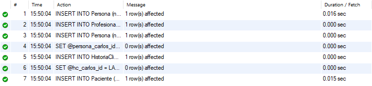
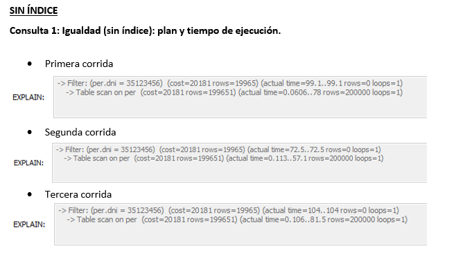
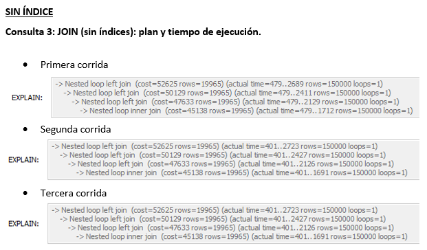

# Anexo - Evidencias de Ejecución e Interacción con IA

Este documento recopila las evidencias visuales (capturas de pantalla) y los registros de interacción con herramientas de Inteligencia Artificial (IA) correspondientes a cada etapa del Trabajo Final Integrador de Bases de Datos I, como se referencia en el informe principal (`informe_db_i.md`).

---

## Etapa 1: Modelado y Definición

### 1.1 Resultados de Ejecución

Resultados de la validación de las `constraints` del esquema normalizado.

- **Inserciones Correctas:**

- **Inserciones Erróneas (Validación de Constraints):**

### 1.2 Interacción con IA (Modelado y Normalización)

Registro del diálogo con la IA para validar el proceso de normalización.

- **Prompt Utilizado:**

> Actúa como un tutor de la asignatura Bases de Datos I (base de datos relacionales). Estamos con mi grupo diseñando el esquema para un sistema de gestión de pacientes y hemos creado un primer modelo con las tablas Paciente e HistoriaClinica, pero creo que viola la 3FN porque el DNI determina otros campos como el nombre y el apellido.
> Nuestra idea es crear una tabla Persona para solucionar esto. ¿Puedes guiarnos con preguntas para validar si esta es la mejor estrategia? Ayúdanos a pensar en las ventajas de escalabilidad de este nuevo modelo sin darnos la solución directamente.

- **Respuesta Resumida de la IA:**

> La IA validó la identificación de la dependencia transitiva y la propuesta de crear la tabla Persona. Luego, formuló preguntas guía centradas en:
>
> - La naturaleza de la relación entre Persona y Paciente (es un/tiene un, cardinalidad, clave de conexión).
> - Las ventajas de escalabilidad al considerar futuros roles (como Profesional) y cómo el modelo Persona evitaría la duplicación de datos.
> - La mejora en la integridad y el mantenimiento al actualizar datos (como un cambio de apellido) en un solo lugar.

- **Reflexión:**

> Las preguntas de la IA nos ayudaron a confirmar que la relación es "Paciente es una Persona" (1:1), justificando la FK persona_id con UNIQUE. Nos hizo ver claramente la ventaja de escalabilidad al poder añadir roles como Profesional sin redundancia y cómo una única Persona podría asumir múltiples roles. También reforzó la ventaja en el mantenimiento, ya que los datos personales se actualizan en un único registro. Esto solidificó nuestra decisión de adoptar el modelo normalizado.

---

## Etapa 2: Carga Masiva de Datos

### 2.1 Resultados de Ejecución

Confirmación de la carga y conteo final de registros.

- **Confirmación de Carga y Conteo:**

### 2.2 Interacción con IA (Carga Masiva y Optimización)

Registro del diálogo con la IA sobre técnicas de generación de datos.

- **Prompt Utilizado:**

> Estoy creando un script de carga masiva en MySQL [...]. Noté que la distribución de los grupos sanguíneos es uniforme [...]. Quiero implementar una distribución ponderada [...]. ¿Puedes explicarme la lógica detrás de usar RAND() con CASE para simular porcentajes? No me des el código completo, solo explícame el concepto [...].

- **Respuesta Resumida de la IA:**

> La IA explicó que RAND() genera un número entre 0 y 1 y que la estructura CASE WHEN RAND() < P1 THEN VAL1 WHEN RAND() < P1+P2 THEN VAL2 ... ELSE VALN END permite asignar valores diferentes según rangos de probabilidad acumulada, simulando así una distribución no uniforme.

- **Reflexión:**

> La explicación nos permitió entender cómo asignar probabilidades acumuladas a cada grupo sanguíneo dentro del CASE, logrando una distribución mucho más realista en los datos generados, donde O+ y A+ son significativamente más frecuentes que AB-.

---

## Etapa 3: Consultas Complejas y Útiles

### 3.1 Resultados de Ejecución

Ejemplos de los resultados obtenidos al ejecutar las consultas complejas.

- **Consulta 1 (Ficha Pacientes):**

- **Consulta 2 (Pacientes por Especialidad):**

- **Consulta 3 (Grupos Minoritarios):**

- **Consulta 4 (Profesionales Sobrecargados):**

- **Uso de Vista 1 (`vw_pacientes_activos`):**

- **Uso de Vista 2 (`vw_pacientes_publicos`):**

- **Uso de Vista 3 (`vw_profesionales_publicos`):**

### 3.2 Resultados de Pruebas de Rendimiento con y sin índices

Se evalúa el impacto de los índices en tres tipos de consultas:

1. Igualdad (WHERE =)
2. Rango (LIKE / BETWEEN)
3. JOIN (relaciones entre tablas)

- **Capturas de consultas:**

### 3.3 Interacción con IA (Diseño y Optimización de Consultas)

Registro del diálogo sobre la optimización de consultas.

- **Prompt Utilizado:**

> Actúa como un analista de datos. Para nuestro sistema, necesitamos crear una consulta que muestre las historias clínicas que aún no tienen un profesional asignado [...]. Hemos pensado en usar una subconsulta correlacionada [...], pero nos preocupa el rendimiento [...]. ¿Podrías explicarnos las ventajas y desventajas [...] y mencionarnos qué alternativa con JOIN podríamos considerar? Ayúdanos a comparar [...].

- **Respuesta Resumida de la IA:**

> La IA explicó que la subconsulta correlacionada, aunque legible, es muy ineficiente ("como un bucle FOR dentro de otro") porque se ejecuta una vez por cada fila externa. Contrastó esto con la alternativa LEFT JOIN, describiéndola como la forma idiomática y de rendimiento superior en SQL, ya que permite al motor optimizar la unión de conjuntos de datos usando índices.

- **Reflexión:**

> La comparación detallada y la analogía proporcionada por la IA nos convencieron de la superioridad del LEFT JOIN para este tipo de consultas, especialmente considerando nuestro gran volumen de datos. Aunque para cumplir la consigna de usar una subconsulta optamos por un caso diferente (profesionales sobre el promedio), esta interacción fue clave para entender las implicaciones de rendimiento de cada enfoque y tomar decisiones informadas al diseñar otras consultas.

---

## Etapa 4: Seguridad e Integridad

### 4.1 Resultados de Ejecución

Evidencias de la creación del usuario restringido.

- **Creación de Usuario:**

- **Asignación de Privilegios:**

### 4.2 Interacción con IA (Seguridad)

Registro del diálogo sobre privilegios limitados.

- **Prompt Utilizado:**

> ¿Cómo puedo crear un usuario con privilegios limitados en MySQL para que la aplicación solo pueda leer e insertar datos sin poder borrar ni alterar tablas?

- **Respuesta Resumida de la IA:**

> Asigná permisos SELECT, INSERT y UPDATE sobre las tablas necesarias y creá vistas para exponer solo la información útil. Evitá permisos como DELETE, DROP o ALTER.

- **Reflexión:**

> La sugerencia me ayudó a entender cómo aplicar la regla de privilegios mínimos y a usar vistas para proteger datos sensibles. Aprendí que la seguridad no solo depende del código, sino también del diseño de la base.

---

## Etapa 5: Concurrencia y Transacciones

### 5.1 Resultados de Simulación

Evidencias de las pruebas de deadlock y niveles de aislamiento.

- **Simulación de Deadlock:**

- **Comparación de Niveles de Aislamiento:**
  - **READ COMMITTED:** `[Captura(s) de pantalla mostrando la lectura no repetible]`
  - 
Parte 1
 

Parte 2
 

- **REPEATABLE READ:** `[Captura(s) de pantalla mostrando la lectura consistente (sin lectura no repetible)]`

Parte 1
 

Parte 2
 

### 5.2 Interacción con IA (Concurrencia)

Registro del diálogo sobre la simulación de deadlocks.

- **Prompt Utilizado:**

> Ejecutamos una transacción simple que primero lee el nombre de un paciente de la tabla paciente, luego hacemos una pausa de 5 segundos, y al volver a leer el nombre, encontramos que ha cambiado. La base de datos está en READ COMMITTED. ¿Qué significa que el dato cambie dentro de mi transacción y cómo lo evito usando un nivel de aislamiento?

- **Respuesta Resumida de la IA:**

> Sugerencia (Paso Adicional Simple): Para evitar que el dato cambie dentro de su transacción, debe usar un nivel de aislamiento más estricto que mantenga una "instantánea" (snapshot) de los datos que lee.

- **Reflexión:**

> La sugerencia me ayudó a entender cómo usar REPEATABLE READ, se evita que los datos que ya se han leído cambien, forzando la consistencia hasta que confirme o revierta la transacción.

---

_Fin del Anexo de Evidencias._
