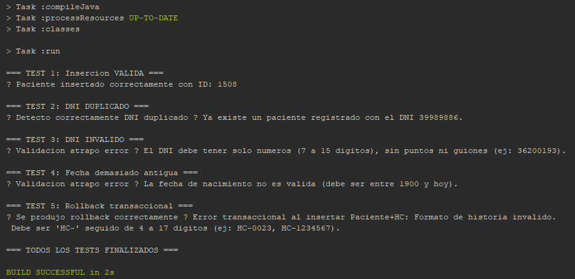
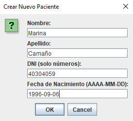
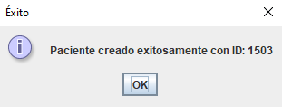
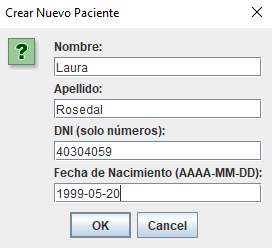
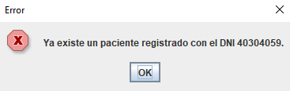
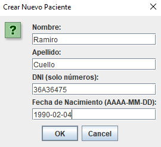
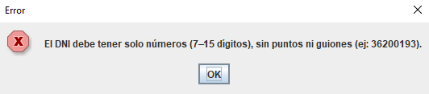
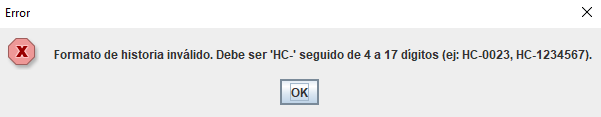
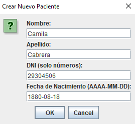
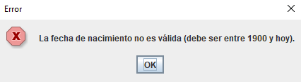

# Anexo: Pruebas Realizadas y Capturas de Pantalla

Este documento complementa la sección 7 ("Pruebas Realizadas") del informe, proporcionando la evidencia visual de las pruebas funcionales y de lógica de negocio.

## 1. Pruebas de Lógica de Negocio (ServiceTest)

Esta es la salida de la clase `ServiceTest.java`, que comprueba la capa de servicio (validaciones, unicidad y rollback) de forma automatizada antes de la implementación de la UI.

---

## 2. Pruebas de Interfaz de Usuario (Manual)

Las siguientes capturas (tomadas de la GUI de `JOptionPane`) demuestran que las mismas reglas de negocio probadas en `ServiceTest.java` se capturan y manejan correctamente en la capa de Vistas (`views/gui/`).

### Test 1: Creación Exitosa

Se ingresan datos válidos para un Paciente.

**Entrada:**

**Resultado:**
La aplicación procesa la solicitud y confirma la creación con éxito.

---

### Test 2: Error de DNI Duplicado (RN-002)

Se intenta crear un Paciente con un DNI que ya existe en la base de datos.

**Entrada:**

**Resultado:**
La capa de servicio (`PacienteService`) detecta la violación de unicidad y lanza una `DuplicateEntityException`, que la GUI muestra al usuario.

---

### Test 3: Error de Formato de DNI (RN-001.6)

Se intenta crear un Paciente con un DNI que no cumple con el formato (regex `^[0-9]{7,15}$`).

**Entrada:**

**Resultado:**
La capa de servicio (`PacienteService.validateEntity`) detecta el formato incorrecto y lanza una `ValidationException`.

---

### Test 4: Error de Formato de Nro. Historia (RN-017 / Rollback)

Se intenta crear un Paciente válido, pero con una Historia Clínica cuyo `nroHistoria` no cumple con el formato (regex `^HC-[0-9]{4,17}$`).

**Entrada:**

**Resultado:**
La capa de servicio (`HistoriaClinicaService`) lanza una `ValidationException`. El `PacienteService` (que orquesta la operación) falla, demostrando el **rollback a nivel de servicio**: el Paciente (que era válido) no se crea.

---

### Test 5: Error de Rango de Fecha (RN-001.7)

Se intenta crear un Paciente con una `fechaNacimiento` que está fuera del rango permitido (anterior a 1900 o futura).

**Entrada:**

**Resultado:**
La capa de servicio (`PacienteService.validateEntity`) detecta la fecha inválida y lanza una `ValidationException`.

