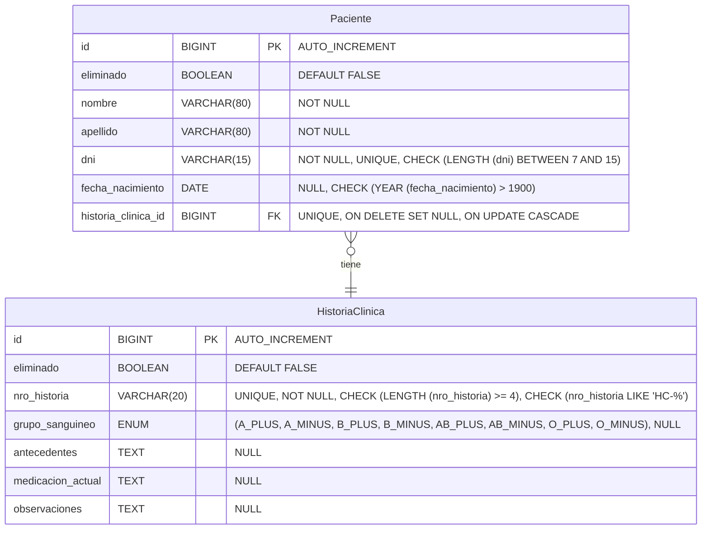
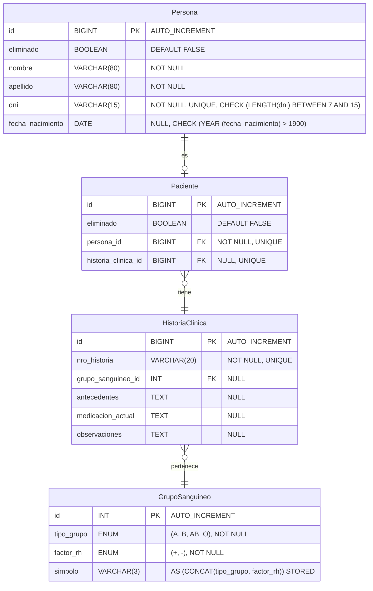

# Trabajo Final Integrador - Sistema de Gestión de Pacientes e Historias Clínicas

   [](https://github.com/Gerolupo12/paciente-historia-cliente)

## Datos del Proyecto

- **Asignatura**: Bases de Datos I
- **Dominio**: Paciente → HistoriaClínica (Relación 1→1 unidireccional)

## Integrantes del Grupo

- **Alejandro Lagos** - [GitHub](https://github.com/Alejandrovans)
- **Cristian Lahoz** - [GitHub](https://github.com/m415x)
- **Ariana Maldonado** - [GitHub](https://github.com/AriMaldo19)
- **Gerónimo Ramallo** - [GitHub](https://github.com/Gerolupo12)
---

## Etapa 1 - Modelado y Definición de Constraints

### 1. Modelo Original (Pre-Normalización)

#### 1.1 Diagrama ER Original



#### 1.2 Problemas Detectados en el Modelo Original

##### Violaciones de la 3FN

1. **Dependencias Transitivas en `Paciente`:**

   ```plaintext
   id → nombre, apellido, dni, fecha_nacimiento
   dni → nombre, apellido, fecha_nacimiento  (Dependencia transitiva)
   ```

2. **Mala Representación de Dominios:**

   - No hay separación entre entidad "Persona" y rol "Paciente"
   - El grupo sanguíneo debería ser una entidad propia

3. **Falta de Escalabilidad:**

   - Difícil agregar otros roles (Médico, Enfermero) en el futuro
   - Búsquedas ineficientes por falta de normalización

### 2. Proceso de Normalización a 3FN

#### 2.1 Primera Forma Normal (1FN)

**Ya cumplida** - Todos los atributos son atómicos, no hay grupos repetitivos.

#### 2.2 Segunda Forma Normal (2FN)

**Ya cumplida** - Todas las dependencias son completas de la clave primaria.

#### 2.3 Tercera Forma Normal (3FN)

##### Proceso de eliminación de dependencias transitivas

###### Paso 1: Identificar dependencias transitivas

```plaintext
En Paciente:
id → dni → (nombre, apellido, fecha_nacimiento)  ← DEPENDENCIA TRANSITIVA

En HistoriaClinica:
grupo_sanguineo ENUM contiene información compuesta (tipo + factor Rh)
```

###### Paso 2: Crear o modificar tablas para eliminar transitividades

- **Tabla `Persona`**: Contiene datos personales básicos
- **Tabla `Paciente`**: Solo mantiene relaciones (FK)
- **Tabla `HistoriaClinica`**: Contiene datos clínicos y relación con GrupoSanguineo (FK)
- **Tabla `GrupoSanguineo`**: Contiene los grupos sanguíneos

### 3. Modelo Normalizado (3FN)

#### 3.1 Diagrama ER Normalizado



#### 3.2 Estructura de Tablas Normalizadas

##### Tabla `Persona`

```sql
CREATE TABLE Persona (
    id BIGINT PRIMARY KEY AUTO_INCREMENT,
    eliminado BOOLEAN DEFAULT FALSE,
    nombre VARCHAR(80) NOT NULL,
    apellido VARCHAR(80) NOT NULL,
    dni VARCHAR(15) UNIQUE NOT NULL,
    fecha_nacimiento DATE NULL,
    -- Constraints
    CHECK (LENGTH(dni) BETWEEN 7 AND 15),
    CHECK (YEAR(fecha_nacimiento) > 1900)
);
```

##### Tabla `GrupoSanguineo`

```sql
CREATE TABLE GrupoSanguineo (
    id INT PRIMARY KEY AUTO_INCREMENT,
    tipo_grupo ENUM ('A', 'B', 'AB', 'O') NOT NULL,
    factor_rh ENUM ('+', '-') NOT NULL,
    simbolo VARCHAR(3) AS (CONCAT(tipo_grupo, factor_rh)) STORED,
    -- Constraints
    -- Evita duplicados en la lógica de negocio (combinación tipo + factor).
    -- Ej: No puede haber dos registros con (A, +)
    UNIQUE KEY uk_grupo_factor (tipo_grupo, factor_rh)
);
```

##### Tabla `HistoriaClinica`

```sql
CREATE TABLE HistoriaClinica (
    id BIGINT PRIMARY KEY AUTO_INCREMENT,
    nro_historia VARCHAR(20) NOT NULL UNIQUE,
    grupo_sanguineo_id INT NULL,
    antecedentes TEXT NULL,
    medicacion_actual TEXT NULL,
    observaciones TEXT NULL,
    -- Constraints
    FOREIGN KEY (grupo_sanguineo_id) REFERENCES GrupoSanguineo(id) ON DELETE SET NULL
);
```

##### Tabla `Paciente` (Solo relaciones)

```sql
CREATE TABLE Paciente (
    id BIGINT PRIMARY KEY AUTO_INCREMENT,
    eliminado BOOLEAN DEFAULT FALSE,
    persona_id BIGINT UNIQUE NOT NULL,
    historia_clinica_id BIGINT UNIQUE NULL,
    -- Constraints
    FOREIGN KEY (persona_id) REFERENCES Persona(id) ON DELETE CASCADE,
    FOREIGN KEY (historia_clinica_id) REFERENCES HistoriaClinica(id) ON DELETE SET NULL
);
```

### 4. Validación de Constraints

#### 4.1 Inserciones Correctas

```sql
-- Inserción CORRECTA 1: Persona y Paciente válidos
INSERT INTO Persona (nombre, apellido, dni, fecha_nacimiento)
VALUES ('Juan', 'Pérez', '12345678', '1990-01-01');

INSERT INTO Paciente (persona_id, historia_clinica_id)
VALUES (1, 1);

-- Inserción CORRECTA 2: Historia clínica con grupo sanguíneo válido
INSERT INTO HistoriaClinica (nro_historia, grupo_sanguineo_id)
VALUES ('HC-1', 1);
```

#### 4.2 Inserciones Erróneas (Validación de Constraints)

```sql
-- ERROR 1: Violación UNIQUE en DNI
INSERT INTO Persona (nombre, apellido, dni, fecha_nacimiento)
VALUES ('Duplicado', 'DNI', '12345678', '1990-01-01');

-- ERROR 2: Violación CHECK en fecha_nacimiento
INSERT INTO Persona (nombre, apellido, dni, fecha_nacimiento)
VALUES ('Fecha', 'Inválida', '99999999', '1830-01-01');

-- ERROR 3: Violación FOREIGN KEY (historia_clinica_id inexistente)
INSERT INTO Paciente (persona_id, historia_clinica_id)
VALUES (1, 999);
```

### 5. Uso Pedagógico de IA en el Proceso

#### 5.1 Interacciones Documentadas con IA

**Prompt inicial utilizado:**

> "Estoy trabajando en la normalización a 3FN de un sistema de gestión de pacientes e historias clínicas. He identificado las dependencias transitivas en la tabla Paciente donde dni determina nombre, apellido y fecha_nacimiento. ¿Puedes guiarme en el proceso de descomposición sin darme la solución completa?"

**Asistencia recibida:**

- Sugerencias para la creación de tablas Persona y GrupoSanguineo
- Revisión de constraints y relaciones cardinales

#### 5.2 Evidencias de Aprendizaje

1. Proceso iterativo: Múltiples revisiones del modelo ER
2. Validación de decisiones: Consultas sobre elección de PK/FK
3. Corrección de errores: Sintaxis SQL y diseño de constraints
4. Optimización: Índices y estructuras para mejor performance

### 6. Beneficios de la Normalización

#### 6.1 Cumplimiento de 3FN

| Aspecto                      | Original         | Normalizado    |
| ---------------------------- | ---------------- | -------------- |
| Dependencias Transitivas     | ❌ Presentes     | ✅ Eliminadas  |
| Redundancia de Datos         | ❌ Alta          | ✅ Mínima      |
| Integridad Referencial       | ✅ Básica        | ✅ Robusta     |
| Consistencia con Modelo Java | ❌ Inconsistente | ✅ Consistente |

#### 6.2 Ventajas Operacionales

##### **Búsquedas Más Eficientes:**

```sql
-- ORIGINAL: Búsqueda con muchos campos
SELECT
    *
FROM
    Paciente
WHERE dni = '12345678';

-- NORMALIZADO: Búsqueda optimizada con JOINs
SELECT
    p.*, per.nombre, per.apellido
FROM
    Paciente p
    INNER JOIN Persona per ON p.persona_id = per.id
WHERE
    per.dni = '12345678';
```

##### **Consultas Analíticas Mejoradas:**

```sql
-- Estadísticas por grupo sanguíneo (NORMALIZADO)
SELECT gs.simbolo AS grupo_sanguineo, COUNT(p.id) AS cantidad_pacientes,
    GROUP_CONCAT(CONCAT(per.apellido, ', ', per.nombre) SEPARATOR ' | ') AS pacientes
FROM
    GrupoSanguineo gs
    LEFT JOIN HistoriaClinica hc ON gs.id = hc.grupo_sanguineo_id
    LEFT JOIN Paciente p ON hc.id = p.historia_clinica_id
    LEFT JOIN Persona per ON p.persona_id = per.id
WHERE
    hc.eliminado = FALSE
GROUP BY
    gs.id,
    gs.simbolo
ORDER BY
    gs.simbolo;
```

##### **Escalabilidad Futura:**

- **Múltiples roles**: Fácil agregar `Medico`, `Enfermero` reutilizando `Persona`
- **Datos maestros**: `GrupoSanguineo` puede extenderse con más atributos
- **Búsquedas cruzadas**: Consultas entre diferentes roles de persona

#### 6.3 Comparativa de Rendimiento

| Operación            | Original      | Normalizado        | Mejora |
| -------------------- | ------------- | ------------------ | ------ |
| Inserción Paciente   | 1 tabla       | 2 tablas           | ⬇️     |
| Búsqueda por DNI     | Tabla grande  | Tabla optimizada   | ⬆️     |
| Consultas analíticas | Scan completo | Índices eficientes | ⬆️     |
| Mantenimiento datos  | Complejo      | Simple             | ⬆️     |

### 7. Conclusión

#### **Logros Obtenidos:**

1. Cumplimiento 3FN completo: eliminación de todas las dependencias transitivas. DER con 4 entidades normalizadas
2. Modelo relacional con constraints completos
3. Escalabilidad mejorada para crecimiento futuro
4. Validación práctica con inserciones
5. Evidencia de interacción con IA

#### **Compromisos Aceptados:**

- **Complejidad inicial** mayor en el diseño
- **JOINs adicionales** en consultas simples
- **Scripts de migración** necesarios para datos existentes

#### **Recomendación:**

La normalización a 3FN **es altamente recomendable** para este sistema ya que los beneficios en mantenibilidad, escalabilidad e integridad de datos superan ampliamente la complejidad adicional inicial.

### 8. Anexo 1

#### A. Scripts Completos

- `init_schema.sql` - Creación de tablas y constraints
- `init_db.sql` - Datos iniciales y pruebas
- `pruebas_constraints.sql` - Validación de restricciones
- `pruebas_consultas.sql` - Consultas de prueba

<!-- TODO (ADJUNTAR CAPTURAS)
#### B. Evidencias de Validación

- Resultados de pruebas de constraints
- Mediciones de performance
- Validación de integridad referencial
-->
<!-- TODO (ADJUNTAR CAPTURAS)
#### C. Evidencias de IA

- Capturas de chat con proceso iterativo
- Decisiones validadas mediante IA
- Optimizaciones sugeridas e implementadas
-->

---

## Etapa 2 - Implementación y Carga Masiva de Datos
