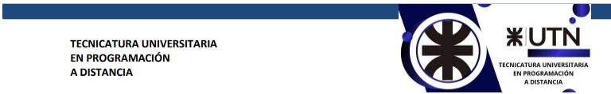

# **Trabajo Final Integrador - Bases de Datos I**

## **Sistema de Gestión de Pacientes – Clínica Gedar, Mendoza**

### **Comisión: Nº 8**

### **Fecha de entrega: 23/10/2025**

### **Profesora asignada**

- **Cinthia, Rigoni**

### **Tutor asignado**

- **García, Pablo**

### **Datos del Proyecto**

- **Tema elegido**: Sistema de Gestión de Pacientes e Historias Clínicas
- **Dominio**: Paciente → HistoriaClínica (Relación 1→1 unidireccional)

### **Integrantes**

Este proyecto fue desarrollado de manera colaborativa por el siguiente equipo:

- **Lahoz, Cristian** - [GitHub](https://github.com/m415x)
- **Maldonado, Ariana** - [GitHub](https://github.com/AriMaldo19)
- **Ramallo, Gerónimo** - [GitHub](https://github.com/Gerolupo12)

---

 
