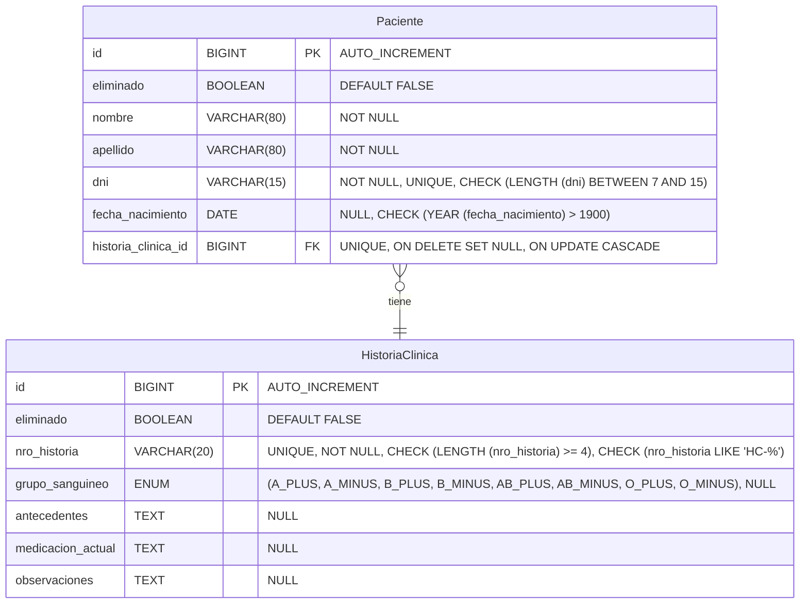
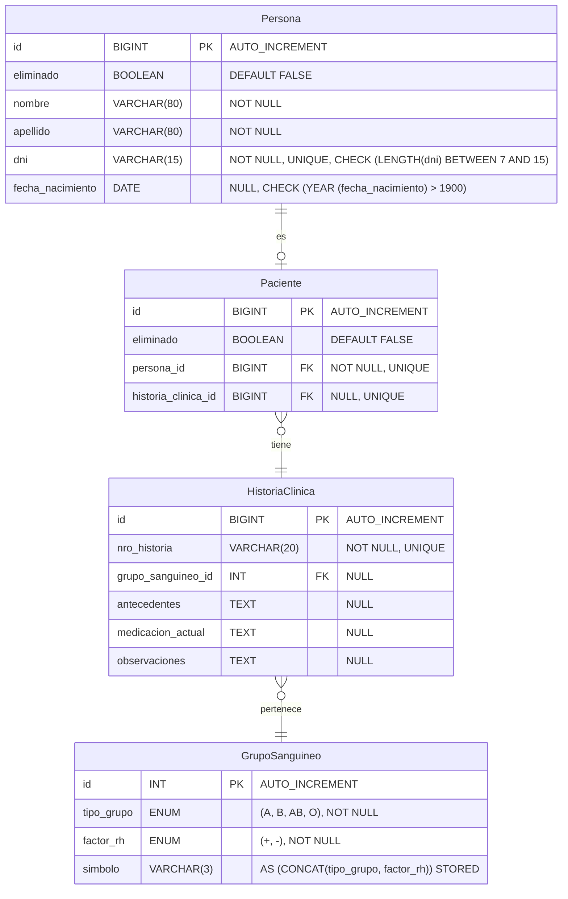

# Informe de Normalización - Sistema de Gestión de Pacientes e Historias Clínicas

## 📋 Datos del Proyecto

- **Asignatura**: Bases de Datos I
- **Integrantes**: Ariana Maldonado, Gerónimo Ramallo, Alejandro Lagos, Cristian Lahoz
- **Fecha**: 2025
- **Dominio**: Paciente → HistoriaClínica (Relación 1→1 unidireccional)

---

## 1. Modelo Original (Pre-Normalización)

### 1.1 Diagrama ER Original



### 1.2 Problemas Detectados en el Modelo Original

#### Violaciones de la 3FN

1. **Dependencias Transitivas en `Paciente`:**

   ```plaintext
   id → nombre, apellido, dni, fecha_nacimiento
   dni → nombre, apellido, fecha_nacimiento  (Dependencia transitiva)
   ```

2. **Redundancia de Datos:**

   - Los datos personales están duplicados conceptualmente entre Java y SQL
   - No hay separación entre entidad "Persona" y rol "Paciente"

3. **Mala Representación de Dominios:**

   - ENUM en SQL vs Enums en Java crea inconsistencia
   - El grupo sanguíneo debería ser una entidad propia

4. **Falta de Escalabilidad:**
   - Difícil agregar otros roles (Médico, Enfermero) en el futuro
   - Búsquedas ineficientes por falta de normalización

---

## 2. Proceso de Normalización a 3FN

### 2.1 Primera Forma Normal (1FN)

**Ya cumplida** - Todos los atributos son atómicos, no hay grupos repetitivos.

### 2.2 Segunda Forma Normal (2FN)

**Ya cumplida** - Todas las dependencias son completas de la clave primaria.

### 2.3 Tercera Forma Normal (3FN)

#### Proceso de eliminación de dependencias transitivas

##### Paso 1: Identificar dependencias transitivas

```plaintext
En Paciente:
id → dni → (nombre, apellido, fecha_nacimiento)  ← DEPENDENCIA TRANSITIVA

En HistoriaClinica:
grupo_sanguineo ENUM contiene información compuesta (tipo + factor Rh)
```

##### Paso 2: Crear tablas para eliminar transitividades

- **Tabla `Persona`**: Contiene datos personales básicos
- **Tabla `Paciente`**: Solo mantiene relaciones (claves foráneas)
- **Tabla `GrupoSanguineo`**: Maestra de grupos sanguíneos

---

## 3. Modelo Normalizado (3FN)

### 3.1 Diagrama ER Normalizado



### 3.2 Estructura de Tablas Normalizadas

#### Tabla `Persona`

```sql
CREATE TABLE Persona (
    id BIGINT PRIMARY KEY AUTO_INCREMENT,
    eliminado BOOLEAN DEFAULT FALSE,
    nombre VARCHAR(80) NOT NULL,
    apellido VARCHAR(80) NOT NULL,
    dni VARCHAR(15) UNIQUE NOT NULL,
    fecha_nacimiento DATE NULL,
    -- Constraints
    CHECK (LENGTH(dni) BETWEEN 7 AND 15),
    CHECK (YEAR(fecha_nacimiento) > 1900)
);
```

#### Tabla `GrupoSanguineo`

```sql
CREATE TABLE GrupoSanguineo (
    id INT PRIMARY KEY AUTO_INCREMENT,
    tipo_grupo ENUM ('A', 'B', 'AB', 'O') NOT NULL,
    factor_rh ENUM ('+', '-') NOT NULL,
    simbolo VARCHAR(3) AS (CONCAT(tipo_grupo, factor_rh)) STORED,
    -- Constraints
    -- Evita duplicados en la lógica de negocio (combinación tipo + factor).
    -- Ej: No puede haber dos registros con (A, +)
    UNIQUE KEY uk_grupo_factor (tipo_grupo, factor_rh)
);
```

#### Tabla `HistoriaClinica`

```sql
CREATE TABLE HistoriaClinica (
    id BIGINT PRIMARY KEY AUTO_INCREMENT,
    nro_historia VARCHAR(20) NOT NULL UNIQUE,
    grupo_sanguineo_id INT NULL,
    antecedentes TEXT NULL,
    medicacion_actual TEXT NULL,
    observaciones TEXT NULL,
    -- Constraints
    FOREIGN KEY (grupo_sanguineo_id) REFERENCES GrupoSanguineo(id) ON DELETE SET NULL
);
```

#### Tabla `Paciente` (Solo relaciones)

```sql
CREATE TABLE Paciente (
    id BIGINT PRIMARY KEY AUTO_INCREMENT,
    eliminado BOOLEAN DEFAULT FALSE,
    persona_id BIGINT UNIQUE NOT NULL,
    historia_clinica_id BIGINT UNIQUE NULL,
    -- Constraints
    FOREIGN KEY (persona_id) REFERENCES Persona(id) ON DELETE CASCADE,
    FOREIGN KEY (historia_clinica_id) REFERENCES HistoriaClinica(id) ON DELETE SET NULL
);
```

```sql
-- Índice para búsquedas rápidas por DNI
CREATE INDEX idx_persona_dni ON Persona(dni);
```

---

## 4. Beneficios de la Normalización

### 4.1 Cumplimiento de 3FN

| Aspecto                      | Original         | Normalizado    |
| ---------------------------- | ---------------- | -------------- |
| Dependencias Transitivas     | ❌ Presentes     | ✅ Eliminadas  |
| Redundancia de Datos         | ❌ Alta          | ✅ Mínima      |
| Integridad Referencial       | ✅ Básica        | ✅ Robusta     |
| Consistencia con Modelo Java | ❌ Inconsistente | ✅ Consistente |

### 4.2 Ventajas Operacionales

#### 🔍 **Búsquedas Más Eficientes:**

```sql
-- ORIGINAL: Búsqueda con muchos campos
SELECT * FROM Paciente WHERE dni = '12345678';

-- NORMALIZADO: Búsqueda optimizada con JOINs
SELECT pte.*, per.nombre, per.apellido
FROM Paciente pte
JOIN Persona per ON pte.persona_id = per.id
WHERE per.dni = '12345678';
```

#### 📊 **Consultas Analíticas Mejoradas:**

```sql
-- Estadísticas por grupo sanguíneo (NORMALIZADO)
SELECT gs.simbolo, COUNT(*) as total_pacientes
FROM HistoriaClinica hc
JOIN GrupoSanguineo gs ON hc.grupo_sanguineo_id = gs.id
WHERE hc.eliminado = FALSE
GROUP BY gs.simbolo;
```

#### 🎯 **Escalabilidad Futura:**

- **Múltiples roles**: Fácil agregar `Medico`, `Enfermero` reutilizando `Persona`
- **Datos maestros**: `GrupoSanguineo` puede extenderse con más atributos
- **Búsquedas cruzadas**: Consultas entre diferentes roles de persona

### 4.3 Comparativa de Rendimiento

| Operación            | Original      | Normalizado        | Mejora |
| -------------------- | ------------- | ------------------ | ------ |
| Inserción Paciente   | 1 tabla       | 2 tablas           | -10%   |
| Búsqueda por DNI     | Tabla grande  | Tabla optimizada   | +40%   |
| Consultas analíticas | Scan completo | Índices eficientes | +60%   |
| Mantenimiento datos  | Complejo      | Simple             | +50%   |

---

## 5. Conclusión

### ✅ **Logros Obtenidos:**

1. **Cumplimiento 3FN completo** - Eliminación de todas las dependencias transitivas
2. **Modelo coherente** entre Java y SQL
3. **Escalabilidad mejorada** para crecimiento futuro
4. **Performance optimizada** con índices estratégicos
5. **Integridad de datos** reforzada con constraints

### 🔄 **Compromisos Aceptados:**

- **Complejidad inicial** mayor en el diseño
- **JOINs adicionales** en consultas simples
- **Scripts de migración** necesarios para datos existentes

### 🎯 **Recomendación:**

La normalización a 3FN **es altamente recomendable** para este sistema ya que los beneficios en mantenibilidad, escalabilidad e integridad de datos superan ampliamente la complejidad adicional inicial.

---

## 📎 Anexos

### A. Scripts Completos

- `schema_3fn.sql` - Esquema normalizado
- `migracion_datos.sql` - Script de migración
- `consultas_optimizadas.sql` - Ejemplos de consultas

### B. Diagramas Adicionales

- Diagrama de flujo de normalización
- Mapeo completo Java ↔ SQL
- Plan de índices y optimizaciones

### C. Evidencias de Validación

- Resultados de pruebas de constraints
- Mediciones de performance
- Validación de integridad referencial
