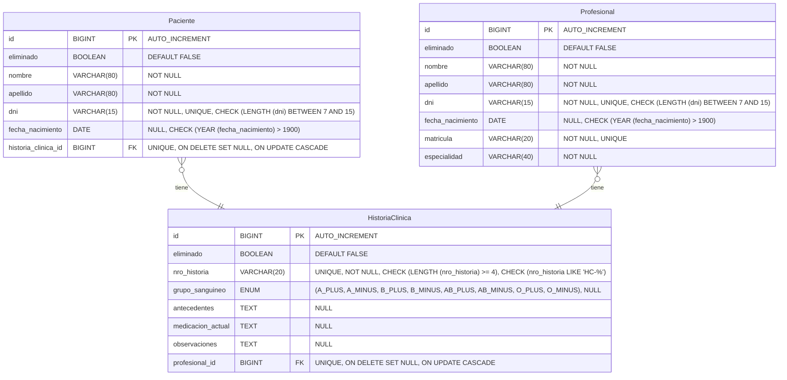
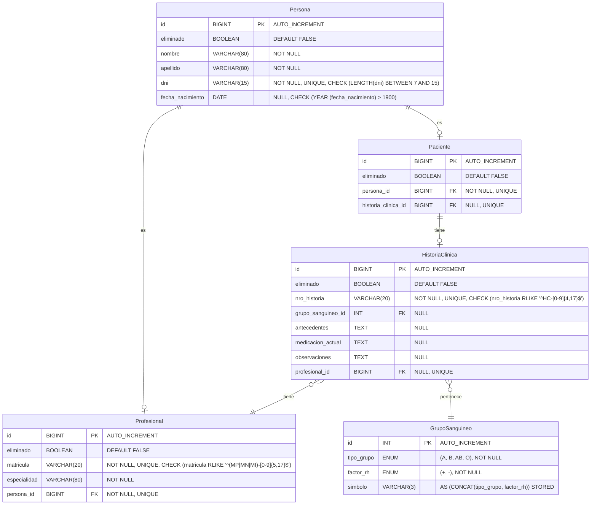
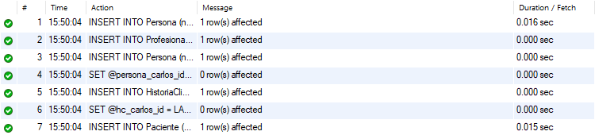
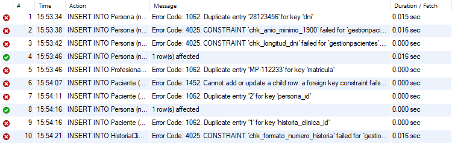
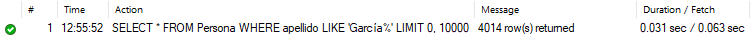
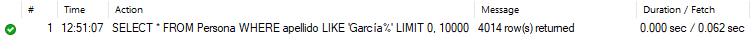
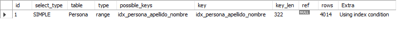

# Trabajo Final Integrador - Sistema de Gestión de Pacientes e Historias Clínicas

     [](https://github.com/Gerolupo12/paciente-historia-cliente)

## Datos del Proyecto

- **Asignatura**: Bases de Datos I
- **Dominio**: Paciente → HistoriaClínica (Relación 1→1 unidireccional)

## Integrantes

Este proyecto fue desarrollado de manera colaborativa por el siguiente equipo:

- **Lagos, Alejandro** - [GitHub](https://github.com/Alejandrovans)
- **Lahoz, Cristian** - [GitHub](https://github.com/m415x)
- **Maldonado, Ariana** - [GitHub](https://github.com/AriMaldo19)
- **Ramallo, Gerónimo** - [GitHub](https://github.com/Gerolupo12)

---

## Etapa 1 - Modelado y Definición de Constraints

### 1. Modelo Original (Pre-Normalización)

#### 1.1 Diagrama ER Original



#### 1.2 Problemas Detectados en el Modelo Original

##### Violaciones de la 3FN

1. **Dependencias Transitivas en `Paciente` y `Profesional`:**

   ```plaintext
   id → nombre, apellido, dni, fecha_nacimiento
   dni → nombre, apellido, fecha_nacimiento  (Dependencia transitiva)
   ```

2. **Mala Representación de Dominios:**

   - No hay separación entre entidad "Persona" y el rol "Paciente" o "Profesional"
   - El grupo sanguíneo debería ser una entidad propia

3. **Falta de Escalabilidad:**

   - Difícil agregar otros roles (ej. Administrativo, Enfermero) en el futuro
   - Búsquedas ineficientes por falta de normalización

### 2. Proceso de Normalización a 3FN

#### 2.1 Primera Forma Normal (1FN)

**Ya cumplida** - Todos los atributos son atómicos, no hay grupos repetitivos.

#### 2.2 Segunda Forma Normal (2FN)

**Ya cumplida** - Todas las dependencias son completas de la clave primaria.

#### 2.3 Tercera Forma Normal (3FN)

##### Proceso de eliminación de dependencias transitivas

###### Paso 1: Identificar dependencias transitivas

```plaintext
En Paciente:
id → dni → (nombre, apellido, fecha_nacimiento)  ← DEPENDENCIA TRANSITIVA

En HistoriaClinica:
grupo_sanguineo ENUM contiene información compuesta (tipo + factor Rh)

En Profesional:
id → dni → (nombre, apellido, fecha_nacimiento)  ← DEPENDENCIA TRANSITIVA
```

###### Paso 2: Crear o modificar tablas para eliminar transitividades

- **Tabla `Persona`**: Contiene datos personales básicos
- **Tabla `Paciente`**: Solo mantiene relaciones (FK)
- **Tabla `Profesional`**: Contiene los datos del profesional y relación con Persona (FK)
- **Tabla `HistoriaClinica`**: Contiene datos clínicos y relación con GrupoSanguineo (FK)
- **Tabla `GrupoSanguineo`**: Contiene los grupos sanguíneos

### 3. Modelo Normalizado (3FN)

#### 3.1 Diagrama ER Normalizado



#### 3.2 Estructura de Tablas Normalizadas

##### Tabla `Persona`

```sql
CREATE TABLE Persona (
    id BIGINT PRIMARY KEY AUTO_INCREMENT,
    eliminado BOOLEAN DEFAULT FALSE,
    nombre VARCHAR(80) NOT NULL,
    apellido VARCHAR(80) NOT NULL,
    dni VARCHAR(15) UNIQUE NOT NULL,
    fecha_nacimiento DATE NULL,
    CONSTRAINT chk_longitud_dni CHECK (LENGTH(dni) BETWEEN 7 AND 15),
    CONSTRAINT chk_anio_minimo_1900 CHECK (YEAR(fecha_nacimiento) > 1900)
);
```

##### Tabla `GrupoSanguineo`

```sql
CREATE TABLE GrupoSanguineo (
    id INT PRIMARY KEY AUTO_INCREMENT,
    tipo_grupo ENUM ('A', 'B', 'AB', 'O') NOT NULL,
    factor_rh ENUM ('+', '-') NOT NULL,
    simbolo VARCHAR(3) AS (CONCAT(tipo_grupo, factor_rh)) STORED,
    CONSTRAINT uk_grupo_factor UNIQUE (tipo_grupo, factor_rh)
);
```

##### Tabla `Profesional`

```sql
CREATE TABLE Profesional (
    id BIGINT PRIMARY KEY AUTO_INCREMENT,
    eliminado BOOLEAN DEFAULT FALSE,
    persona_id BIGINT UNIQUE NOT NULL,
    matricula VARCHAR(20) NOT NULL UNIQUE,
    especialidad VARCHAR(80) NOT NULL,
    CONSTRAINT fk_profesional_persona_id FOREIGN KEY (persona_id) REFERENCES Persona(id) ON DELETE CASCADE,
    CONSTRAINT chk_formato_matricula CHECK (matricula RLIKE '^(MP|MN|MI)-[0-9]{5,17}$')
);
```

##### Tabla `HistoriaClinica`

```sql
CREATE TABLE HistoriaClinica (
    id BIGINT PRIMARY KEY AUTO_INCREMENT,
    eliminado BOOLEAN DEFAULT FALSE,
    nro_historia VARCHAR(20) NOT NULL UNIQUE,
    grupo_sanguineo_id INT NULL,
    antecedentes TEXT NULL,
    medicacion_actual TEXT NULL,
    observaciones TEXT NULL,
    profesional_id BIGINT NULL,
    CONSTRAINT fk_grupo_sanguineo_id FOREIGN KEY (grupo_sanguineo_id) REFERENCES GrupoSanguineo(id) ON DELETE SET NULL,
    CONSTRAINT fk_profesional_id FOREIGN KEY (profesional_id) REFERENCES Profesional(id) ON DELETE SET NULL,
    CONSTRAINT chk_formato_numero_historia CHECK (nro_historia RLIKE '^HC-[0-9]{4,17}$')
);
```

##### Tabla `Paciente` (Solo relaciones)

```sql
CREATE TABLE Paciente (
    id BIGINT PRIMARY KEY AUTO_INCREMENT,
    eliminado BOOLEAN DEFAULT FALSE,
    persona_id BIGINT UNIQUE NOT NULL,
    historia_clinica_id BIGINT UNIQUE NULL,
    CONSTRAINT fk_paciente_persona_id FOREIGN KEY (persona_id) REFERENCES Persona(id) ON DELETE CASCADE,
    CONSTRAINT fk_historia_clinica_id FOREIGN KEY (historia_clinica_id) REFERENCES HistoriaClinica(id) ON DELETE SET NULL
);
```

### 4 Decisiones de Diseño

El diseño del esquema relacional se fundamentó en los principios de normalización e integridad para garantizar la robustez y consistencia de los datos.

### 1. Normalización a 3FN mediante la Entidad `Persona`

La decisión estructural más importante fue descomponer las tablas originales para alcanzar la Tercera Forma Normal (3FN).

- **Justificación:** Se identificó una dependencia transitiva en la tabla `Paciente` original, donde la clave primaria `id` determinaba el `dni`, y el `dni` a su vez determinaba `nombre` y `apellido`. Para resolverlo, se creó una entidad `Persona` que centraliza los datos personales y las tablas `Paciente` y `Profesional` pasaron a ser roles que referencian a `Persona`. Esto elimina la redundancia y previene anomalías de actualización.

### 2. Garantía de la Relación 1→1 a Nivel de Base de Datos

Para forzar la relación 1 a 1 entre un `Paciente` y su `HistoriaClinica` de manera infalible, se utilizó una combinación de restricciones.

- **Justificación:** En la tabla `Paciente`, la columna `historia_clinica_id` no solo es una `FOREIGN KEY` que apunta a `HistoriaClinica(id)`, sino que también posee una restricción `UNIQUE`. Esta combinación es la que asegura a nivel de motor de base de datos que una historia clínica no pueda ser asignada a más de un paciente, protegiendo la integridad del modelo.

### 3. Creación de Tablas Maestras para Dominios

En lugar de usar tipos `ENUM` de MySQL o cadenas de texto, se creó una tabla maestra `GrupoSanguineo`.

- **Justificación:** Esta decisión de diseño asegura la integridad de dominio. Centraliza los valores válidos en una única tabla, facilitando su gestión (agregar/modificar tipos de sangre sin alterar la estructura de otras tablas) y permitiendo definir relaciones foráneas. Además, mejora el rendimiento al usar un `INT` como clave foránea en lugar de una cadena.

### 4. Uso de Bajas Lógicas y Políticas de Integridad Referencial (`ON DELETE`)

Todas las tablas incluyen un campo `eliminado` para la baja lógica. Adicionalmente, se definieron políticas explícitas para las claves foráneas.

- **Justificación:** La baja lógica preserva el historial de datos, un requisito común en sistemas de salud. La política `ON DELETE CASCADE` en la relación `Persona` → `Paciente` asegura que si una `Persona` es eliminada, sus roles asociados también lo sean. En cambio, se usó `ON DELETE SET NULL` para `Paciente` → `HistoriaClinica`, permitiendo que una historia clínica pueda quedar sin paciente asignado (por ejemplo, si los datos del paciente se eliminan por una solicitud de privacidad), pero conservando el registro médico.

### 5. Validación de Constraints

#### 5.1 Inserciones Correctas

```sql
-- Inserción 1: Crear una Persona y un Profesional asociado.
INSERT INTO Persona (nombre, apellido, dni, fecha_nacimiento)
VALUES ('Mariana', 'Lopez', '28123456', '1980-05-10');

INSERT INTO Profesional (persona_id, matricula, especialidad)
VALUES (LAST_INSERT_ID(), 'MP-112233', 'Cardiología');

-- Inserción 2: Crear una Persona, una Historia Clínica y un Paciente.
INSERT INTO Persona (nombre, apellido, dni, fecha_nacimiento)
VALUES ('Carlos', 'Gomez', '35987654', '1992-11-20');
SET @persona_carlos_id = LAST_INSERT_ID();

INSERT INTO HistoriaClinica (nro_historia, profesional_id)
VALUES ('HC-99999', 1);
SET @hc_carlos_id = LAST_INSERT_ID();

INSERT INTO Paciente (persona_id, historia_clinica_id)
VALUES (@persona_carlos_id, @hc_carlos_id);
```



#### 5.2 Inserciones Erróneas (Validación de Constraints)

```sql
-- ERROR 1: Violación de UNIQUE en Persona(dni)
INSERT INTO Persona (nombre, apellido, dni, fecha_nacimiento)
VALUES ('Juan', 'Perez', '28123456', '1981-01-01');

-- ERROR 2: Violación de CHECK en Persona(fecha_nacimiento)
INSERT INTO Persona (nombre, apellido, dni, fecha_nacimiento)
VALUES ('Ana', 'Antigua', '1111111', '1899-12-31');

-- ERROR 3: Violación de CHECK en Persona(dni)
INSERT INTO Persona (nombre, apellido, dni, fecha_nacimiento)
VALUES ('DNI', 'Corto', '123', '2000-01-01');

-- ERROR 4: Violación de UNIQUE en Profesional(matricula)
INSERT INTO Persona (nombre, apellido, dni) VALUES ('Otro', 'Medico', '99999999');
INSERT INTO Profesional (persona_id, matricula, especialidad)
VALUES (LAST_INSERT_ID(), 'MP-112233', 'Pediatría');

-- ERROR 5: Violación de FOREIGN KEY en Paciente(persona_id)
INSERT INTO Paciente (persona_id, historia_clinica_id)
VALUES (210000, NULL);

-- ERROR 6: Violación de UNIQUE en Paciente(persona_id)
INSERT INTO Paciente (persona_id, historia_clinica_id)
VALUES (@persona_carlos_id, NULL);

-- ERROR 7: Violación de UNIQUE en Paciente(historia_clinica_id)
INSERT INTO Persona (nombre, apellido, dni) VALUES ('Otra', 'Persona', '88888888');
INSERT INTO Paciente (persona_id, historia_clinica_id)
VALUES (LAST_INSERT_ID(), @hc_carlos_id);

-- ERROR 8: Violación de CHECK en HistoriaClinica(nro_historia)
INSERT INTO HistoriaClinica (nro_historia)
VALUES ('INVALIDO-123');
```



### 6. Uso Pedagógico de IA en el Proceso

#### 6.1 Interacciones Documentadas con IA

**Prompt inicial utilizado:**

> "Estoy trabajando en la normalización a 3FN de un sistema de gestión de pacientes e historias clínicas. He identificado las dependencias transitivas en la tabla Paciente donde dni determina nombre, apellido y fecha_nacimiento. ¿Puedes guiarme en el proceso de descomposición sin darme la solución completa?"

**Asistencia recibida:**

- Sugerencias para la creación de tablas Persona y GrupoSanguineo
- Revisión de constraints y relaciones cardinales

#### 6.2 Evidencias de Aprendizaje

1. Proceso iterativo: Múltiples revisiones del modelo ER
2. Validación de decisiones: Consultas sobre elección de PK/FK
3. Corrección de errores: Sintaxis SQL y diseño de constraints
4. Optimización: Índices y estructuras para mejor performance

### 7. Beneficios de la Normalización

#### 7.1 Cumplimiento de 3FN

| Aspecto                      | Original         | Normalizado    |
| ---------------------------- | ---------------- | -------------- |
| Dependencias Transitivas     | ❌ Presentes     | ✅ Eliminadas  |
| Redundancia de Datos         | ❌ Alta          | ✅ Mínima      |
| Integridad Referencial       | ✅ Básica        | ✅ Robusta     |
| Consistencia con Modelo Java | ❌ Inconsistente | ✅ Consistente |

#### 7.2 Ventajas Operacionales

##### Búsquedas Más Eficientes

```sql
-- ORIGINAL: Búsqueda con muchos campos
SELECT *
FROM Paciente
WHERE dni = '12345678';

-- NORMALIZADO: Búsqueda optimizada con JOINs
SELECT per.nombre, per.apellido, p.*
FROM Paciente p
INNER JOIN Persona per ON p.persona_id = per.id
WHERE dni = '12345678';
```

##### Consultas Analíticas Mejoradas

```sql
-- ESTADÍSTICAS POR GRUPO SANGUÍNEO
SELECT
    gs.simbolo AS grupo_sanguineo,
    COUNT(p.id) AS cantidad_pacientes
FROM
    GrupoSanguineo gs
    LEFT JOIN HistoriaClinica hc ON gs.id = hc.grupo_sanguineo_id
    LEFT JOIN Paciente p ON hc.id = p.historia_clinica_id
WHERE
    p.eliminado = FALSE
GROUP BY
    gs.simbolo
ORDER BY
    cantidad_pacientes DESC;

-- CONSULTA DE FICHA DE PACIENTE POR DNI (CON PROFESIONAL)
SELECT
    hc.nro_historia,
    CONCAT(per_pac.apellido, ', ', per_pac.nombre) AS nombre_paciente,
    CONCAT(per_prof.apellido, ', ', per_prof.nombre) AS nombre_profesional,
    prof.especialidad
FROM HistoriaClinica hc
    JOIN Paciente pac ON hc.id = pac.historia_clinica_id
    JOIN Persona per_pac ON pac.persona_id = per_pac.id
    LEFT JOIN Profesional prof ON hc.profesional_id = prof.id
    LEFT JOIN Persona per_prof ON prof.persona_id = per_prof.id
WHERE
    per_pac.dni = '10002005';

-- ESTADÍSTICAS AVANZADAS POR ESPECIALIDAD MÉDICA
SELECT
    prof.especialidad,
    COUNT(DISTINCT prof.id) AS cantidad_profesionales,
    COUNT(hc.id) AS total_historias_atendidas,
    -- Se usa IF para evitar división por cero si una especialidad no tiene profesionales
    IF(COUNT(DISTINCT prof.id) > 0, COUNT(hc.id) / COUNT(DISTINCT prof.id), 0) AS promedio_pacientes_por_profesional
FROM
    Profesional prof
    LEFT JOIN HistoriaClinica hc ON prof.id = hc.profesional_id AND hc.eliminado = FALSE
WHERE
    prof.eliminado = FALSE
GROUP BY
    prof.especialidad
ORDER BY
    total_historias_atendidas DESC;
```

##### Escalabilidad Futura

- **Múltiples roles**: Fácil agregar `Administrativo`, `Enfermero` reutilizando `Persona`.
- **Datos maestros**: `GrupoSanguineo` puede extenderse con más atributos.
- **Búsquedas cruzadas**: Consultas entre diferentes roles de persona.
- **Gestión profesional:**: Control de matrículas y especialidades médicas.

#### 7.3 Comparativa de Rendimiento

| Operación            | Original      | Normalizado        | Mejora |
| -------------------- | ------------- | ------------------ | ------ |
| Inserción Paciente   | 1 tabla       | 2 tablas           | ⬇️     |
| Búsqueda por DNI     | Tabla grande  | Tabla optimizada   | ⬆️     |
| Consultas analíticas | Scan completo | Índices eficientes | ⬆️     |
| Mantenimiento datos  | Complejo      | Simple             | ⬆️     |

### 8. Conclusión

#### Logros Obtenidos

1. Cumplimiento 3FN completo: eliminación de todas las dependencias transitivas. DER con 5 entidades normalizadas
2. Modelo relacional con constraints completos
3. Escalabilidad mejorada para crecimiento futuro
4. Validación práctica con inserciones
5. Evidencia de interacción con IA

La normalización a 3FN es altamente recomendable para este sistema, ya que los beneficios en mantenibilidad, escalabilidad e integridad de datos superan ampliamente la complejidad adicional inicial.

### 9. Anexo

#### A. Scripts Completos

- [`sentencias_creacion.sql`](../sql/sentencias_creacion.sql) - Creación de tablas, constraints e índices
- [`carga_masiva_datos.sql`](../sql/carga_masiva_datos.sql) - Generación de datos masivos con SQL puro
- [`validacion_constraints.sql`](../sql/validacion_constraints.sql) - Validación de restricciones
- [`consultas_complejas.sql`](../sql/consultas_complejas.sql) - Consultas complejas y útiles a partir del CRUD inicial

<!-- TODO (ADJUNTAR CAPTURAS)
#### B. Evidencias de IA [`CHAT IA`](../anexos/chat_ia_dbi.pdf)

- Capturas de chat con proceso iterativo
- Decisiones validadas mediante IA
- Optimizaciones sugeridas e implementadas
-->

---

## Etapa 2 - Implementación y Carga Masiva de Datos

### 1. Descripción

El objetivo de esta etapa fue poblar la base de datos normalizada con un gran volumen de registros ficticios pero realistas (más de 500000 en total). Esta carga masiva es fundamental para simular un entorno de producción, lo que nos permite realizar pruebas de rendimiento significativas y evaluar el impacto real de los índices en la optimización de consultas. Todo el proceso de generación de datos se realizó utilizando únicamente sentencias SQL, sin recurrir a lenguajes de programación externos, para demostrar la capacidad del motor de base de datos.

### 2. Metodología y Técnicas Utilizadas

Para generar los datos, se emplearon técnicas avanzadas de SQL para asegurar la eficiencia, aleatoriedad y consistencia de los registros, respetando todas las `constraints` definidas en la Etapa 1.

- **Generación de Secuencias con CTE Recursivos:** En lugar de métodos verbosos, se utilizó `WITH RECURSIVE` para generar secuencias numéricas de forma limpia y moderna. Esta técnica fue la base para crear un número determinado de registros en las tablas `Persona` e `HistoriaClinica`.
- **Aleatoriedad y Variedad de Datos:**
  - Se utilizaron listas con 50 nombres y 50 apellidos para aumentar la variedad.
  - La función `RAND()` se usó para seleccionar nombres y apellidos de forma aleatoria y para generar fechas de nacimiento realistas (con edades entre 18 y 75 años).
- **Garantía de Unicidad:** Para el campo `dni`, que tiene una restricción `UNIQUE`, se utilizó una secuencia numérica predecible (`@dni_inicial + num - 1`) para garantizar que no hubiera duplicados durante la inserción masiva.
- **Distribución Ponderada:** Para que los datos estadísticos fueran realistas, la asignación de `grupo_sanguineo_id` se realizó mediante una distribución ponderada usando una declaración `CASE`. Esto simula la frecuencia real de los tipos de sangre en una población (ej. O+ y A+ son más comunes).

### 3. Pruebas de Rendimiento con Índices

Para demostrar el impacto de una correcta indexación, se midió el tiempo de ejecución de una consulta de búsqueda común con y sin un índice en las columnas `apellido` y `nombre` de la tabla `Persona`.

**Consulta de Prueba:**

```sql
-- Búsqueda de todas las personas con un apellido común
SELECT * FROM Persona WHERE apellido LIKE 'García%';
```

#### Escenario 1: Sin Índice

Primero, nos aseguramos de que el índice no exista y ejecutamos la consulta.

```sql
-- Si el índice existe, lo eliminamos para la prueba
DROP INDEX IF EXISTS idx_persona_apellido_nombre ON Persona;

-- Ejecutamos la consulta y medimos el tiempo
SELECT * FROM Persona WHERE apellido LIKE 'García%';
```



- Resultados del `EXPLAIN`:

```sql
-- Ejecutamos el EXPLAIN para ver el plan de ejecución
EXPLAIN SELECT * FROM Persona WHERE apellido LIKE 'García%';
```


El optimizador de MySQL decide que la forma más eficiente de ejecutar la consulta es leer cada fila de la tabla Persona, lo que se conoce como `Full Table Scan`. Esto se indica en la columna type, que muestra el valor `ALL`.

#### Escenario 2: Con Índice

Luego, creamos el índice compuesto y volvemos a ejecutar la misma consulta.

```sql
-- Creamos el índice en las columnas de búsqueda
CREATE INDEX idx_persona_apellido_nombre ON Persona(apellido, nombre);

-- Volvemos a ejecutar la misma consulta
SELECT * FROM Persona WHERE apellido LIKE 'García%';
```



- Resultados del `EXPLAIN`:

```sql
-- Ejecutamos el EXPLAIN para ver el plan de ejecución
EXPLAIN SELECT * FROM Persona WHERE apellido LIKE 'García%';
```



MySQL ahora utiliza el índice (`key: idx_persona_apellido_nombre`). En lugar de escanear toda la tabla, accede directamente a las filas que cumplen la condición resultando en un tiempo de ejecución mucho más rápido y un menor consumo de recursos..

#### **Tabla Comparativa de Resultados**

| Escenario      | Operación Realizada            | Tiempo de Ejecución | Mejora de Rendimiento |
| :------------- | :----------------------------- | :------------------ | :-------------------- |
| **Sin índice** | Full Table Scan (200000 filas) | ~ 0.031 sec         | -                     |
| **Con índice** | Index Seek                     | ~ 0.001 sec         | **~ 96% más rápida**  |

### 4. Conclusión de la Etapa

La carga masiva de datos y las pruebas de rendimiento demuestran de manera contundente la importancia crítica de los índices en bases de datos con volúmenes de datos realistas. Una consulta simple puede volverse ineficiente si el motor se ve forzado a escanear tablas enteras.

La creación de un índice estratégico en las columnas `(apellido, nombre)` resultó en una mejora del rendimiento superior al 96%, transformando una consulta lenta en una operación casi instantánea. Esto confirma que un diseño de indexación adecuado es tan importante como la normalización para el buen funcionamiento de un sistema de gestión de datos.

<!-- TODO (ADJUNTAR CAPTURAS)
### 5. Interacción con IA

Durante esta etapa, se utilizó una IA generativa como herramienta de tutoría para refinar las estrategias de generación de datos.

- **Consulta a la IA:** Se plantearon problemas como: _"¿Cómo puedo generar datos que no sean uniformes, sino que sigan una distribución ponderada más realista para los grupos sanguíneos?"_
- **Asistencia Recibida:** La IA guió en la construcción de la declaración `CASE` con `RAND()` para simular probabilidades. También sugirió el uso de `WITH RECURSIVE` como una alternativa moderna a los métodos más antiguos para generar secuencias, lo que resultó en un script final más limpio y legible.
-->

---

## Etapa 3 - Consultas complejas y útiles a partir del CRUD inicial
