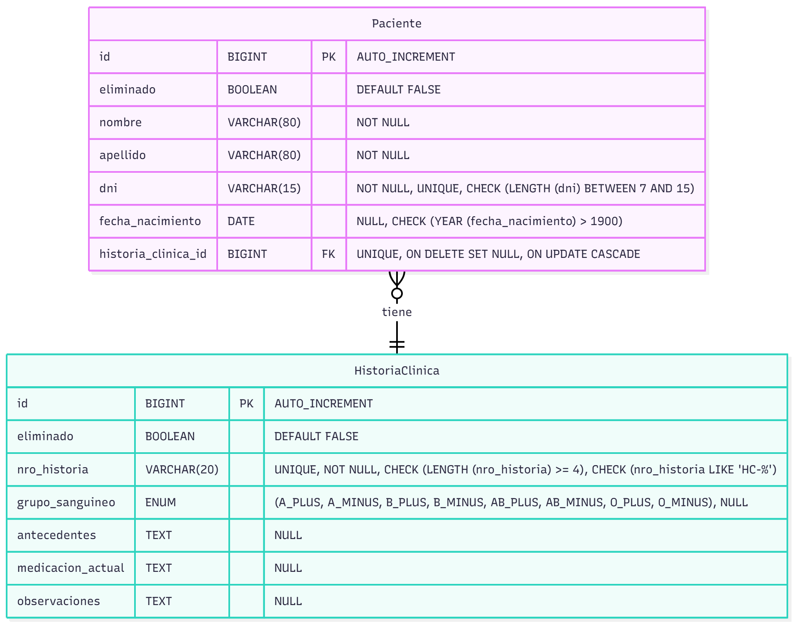

[](https://github.com/Gerolupo12/paciente-historia-cliente) [](https://youtu.be/8V_LVcoTC8A)

# **Trabajo Final Integrador - Bases de Datos I**

## **Sistema de Gestión de Pacientes – Clínica Gedar, Mendoza**

### **Comisión: Nº 8**

### **Fecha de entrega: 23/10/2025**

### **Profesora asignada**

- **Cinthia, Rigoni**

### **Tutor asignado**

- **García, Pablo**

### **Datos del Proyecto**

- **Tema elegido**: Sistema de Gestión de Pacientes e Historias Clínicas
- **Dominio**: Paciente → HistoriaClínica (Relación 1→1 unidireccional)

### **Integrantes**

Este proyecto fue desarrollado de manera colaborativa por el siguiente equipo:

- **Lagos, Alejandro** - [GitHub](https://github.com/Alejandrovans)
- **Lahoz, Cristian** - [GitHub](https://github.com/m415x)
- **Maldonado, Ariana** - [GitHub](https://github.com/AriMaldo19)
- **Ramallo, Gerónimo** - [GitHub](https://github.com/Gerolupo12)

---

## Resumen Ejecutivo

Este trabajo presenta el diseño e implementación de la base de datos relacional para un sistema de gestión de pacientes e historias clínicas, articulado con el TFI de Programación II. Se aplicó rigurosamente la Tercera Forma Normal (3FN), resultando en un esquema robusto con entidades como `Persona`, `Paciente`, `Profesional`, `HistoriaClinica` y `GrupoSanguineo`. Se pobló la base con más de 500000 registros usando solo SQL y se demostró el impacto crítico de los índices en el rendimiento. Finalmente, se abordaron aspectos de seguridad, integridad y concurrencia, validando el diseño mediante pruebas exhaustivas y el uso pedagógico de IA como tutoría.

---

## Reglas de Negocio

Las siguientes reglas de negocio, derivadas del dominio y reforzadas por las `constraints` de la base de datos, gobiernan la integridad y consistencia de la información en el sistema:

### Reglas de Unicidad

1. **Identificación Única de Personas:** Cada persona (`Persona`) registrada en el sistema debe tener un número de Documento Nacional de Identidad (`dni`) único.
2. **Identificación Única de Profesionales:** Cada profesional (`Profesional`) debe tener una matrícula (`matricula`) única.
3. **Identificación Única de Historias Clínicas:** Cada historia clínica (`HistoriaClinica`) debe tener un número de historia (`nro_historia`) único.
4. **Relación Persona-Paciente (1:1):** Una `Persona` solo puede estar asociada a un único registro de `Paciente`.
5. **Relación Persona-Profesional (1:1):** Una `Persona` solo puede estar asociada a un único registro de `Profesional`.
6. **Relación Paciente-Historia Clínica (1:1):** Un `Paciente` solo puede tener asignada una única `HistoriaClinica`, y una `HistoriaClinica` solo puede pertenecer a un único `Paciente`.
7. **Definición Única de Grupos Sanguíneos:** La combinación de `tipo_grupo` y `factor_rh` debe ser única en la tabla `GrupoSanguineo`.

### Reglas de Integridad Referencial

8. **Existencia de Persona:** Un `Paciente` o `Profesional` solo puede existir si está asociado a una `Persona` válida y existente.
9. **Existencia de Historia Clínica (Opcional):** Un `Paciente` puede existir sin tener una `HistoriaClinica` asignada, pero si tiene una asignada, esta debe ser válida y existente.
10. **Existencia de Grupo Sanguíneo (Opcional):** Una `HistoriaClinica` puede no tener un grupo sanguíneo definido, pero si lo tiene, debe corresponder a un registro válido en `GrupoSanguineo`.
11. **Existencia de Profesional (Opcional):** Una `HistoriaClinica` puede no tener un profesional asignado, pero si lo tiene, debe corresponder a un `Profesional` válido y existente.

### Reglas de Dominio y Formato

12. **Datos Personales Obligatorios:** El `nombre` y `apellido` de una `Persona` son obligatorios.
13. **Validez del DNI:** El `dni` debe tener una longitud entre 7 y 15 caracteres numéricos.
14. **Validez Fecha de Nacimiento:** La `fecha_nacimiento` de una `Persona` debe ser posterior al año 1900.
15. **Validez Matrícula Profesional:** La `matricula` debe seguir el formato 'MP-' seguido de 5 a 17 números (ej. 'MP-12345').
16. **Validez Número de Historia Clínica:** El `nro_historia` debe seguir el formato 'HC-' seguido de 4 a 17 números (ej. 'HC-0001').
17. **Baja Lógica:** Todas las entidades principales (`Persona`, `Paciente`, `Profesional`, `HistoriaClinica`) soportan baja lógica a través del campo `eliminado`. Las consultas operativas deben filtrar por `eliminado = FALSE`.

---

## Etapa 1 - Modelado y Definición de Constraints

### 1. Modelo Original (Pre-Normalización)

El punto de partida fue el modelo de dominio definido para la asignatura Programación II, centrado en la relación 1→1 unidireccional entre `Paciente` e `HistoriaClínica`. Inicialmente, las tablas reflejaban directamente las clases Java correspondientes.

#### 1.1 Diagrama ER Original

<!-- ```mermaid
erDiagram
    Paciente {
        id BIGINT PK "AUTO_INCREMENT"
        eliminado BOOLEAN "DEFAULT FALSE"
        nombre VARCHAR(80) "NOT NULL"
        apellido VARCHAR(80) "NOT NULL"
        dni VARCHAR(15) "NOT NULL, UNIQUE, CHECK (LENGTH (dni) BETWEEN 7 AND 15)"
        fecha_nacimiento DATE "NULL, CHECK (YEAR (fecha_nacimiento) > 1900)"
        historia_clinica_id BIGINT FK "UNIQUE, ON DELETE SET NULL, ON UPDATE CASCADE"
    }
    HistoriaClinica {
        id BIGINT PK "AUTO_INCREMENT"
        eliminado BOOLEAN "DEFAULT FALSE"
        nro_historia VARCHAR(20) "UNIQUE, NOT NULL, CHECK (LENGTH (nro_historia) >= 4), CHECK (nro_historia LIKE 'HC-%')"
        grupo_sanguineo ENUM "(A_PLUS, A_MINUS, B_PLUS, B_MINUS, AB_PLUS, AB_MINUS, O_PLUS, O_MINUS), NULL"
        antecedentes TEXT "NULL"
        medicacion_actual TEXT "NULL"
        observaciones TEXT "NULL"
    }
    Paciente }o--|| HistoriaClinica : tiene
``` -->



#### 1.2 Problemas Detectados en el Modelo Original

Se identificaron violaciones a la Tercera Forma Normal (3FN) y oportunidades de mejora:

1. **Dependencias Transitivas en `Paciente`:**

   ```plaintext
   id → nombre, apellido, dni, fecha_nacimiento
   dni → nombre, apellido, fecha_nacimiento  (Dependencia transitiva)
   ```

2. **Mala Representación de Dominios:**

   - El `grupo_sanguineo` como `ENUM` limita la flexibilidad y no sigue las buenas prácticas de normalización.

3. **Falta de Escalabilidad y Riqueza del Dominio:**

   - El modelo inicial era muy básico. Se vio la necesidad de enriquecerlo para representar mejor un entorno clínico real.

### 2. Proceso de Normalización a 3FN y Enriquecimiento del Dominio

#### 2.1 Primera Forma Normal (1FN) y Segunda Forma Normal (2FN)

Ambas formas normales ya se cumplían en el modelo original, ya que todos los atributos eran atómicos y todas las dependencias eran completas respecto a la clave primaria (`id`).

#### 2.2 Tercera Forma Normal (3FN) y Adición de Entidades

Para alcanzar la 3FN y mejorar el modelo, se realizaron los siguientes pasos:

1. **Creación de la Entidad `Persona`:** Se extrajeron los atributos `nombre`, `apellido`, `dni`, `fecha_nacimiento` a una nueva tabla `Persona` para eliminar la dependencia transitiva. `Paciente` ahora referencia a `Persona`.
2. **Creación de la Entidad `GrupoSanguineo`:** Se creó una tabla maestra para los grupos sanguíneos, reemplazando el `ENUM` y permitiendo una gestión más robusta. `HistoriaClinica` ahora referencia a `GrupoSanguineo`.
3. **Introducción de la Entidad `Profesional`:** Durante el proceso de normalización y reflexión sobre el dominio, se decidió incorporar la entidad `Profesional`. Aunque no estaba en el modelo estrictamente mínimo, su adición enriquece significativamente el sistema. Permite vincular una `HistoriaClinica` con el médico tratante, reflejando una relación fundamental en la gestión de pacientes y habilitando futuras consultas y funcionalidades (como buscar pacientes por médico o especialidad). Al igual que `Paciente`, `Profesional` también se vincula a la tabla `Persona`, aprovechando la estructura normalizada.

### 3. Modelo Normalizado (3FN)

#### 3.1 Diagrama ER Normalizado

<!-- ```mermaid
erDiagram
    Persona {
        id BIGINT PK "AUTO_INCREMENT"
        eliminado BOOLEAN "DEFAULT FALSE"
        nombre VARCHAR(80) "NOT NULL"
        apellido VARCHAR(80) "NOT NULL"
        dni VARCHAR(15) "NOT NULL, UNIQUE, CHECK (LENGTH(dni) BETWEEN 7 AND 15)"
        fecha_nacimiento DATE "NULL, CHECK (YEAR (fecha_nacimiento) > 1900)"
    }

    Paciente {
        id BIGINT PK "AUTO_INCREMENT"
        eliminado BOOLEAN "DEFAULT FALSE"
        persona_id BIGINT FK "NOT NULL, UNIQUE"
        historia_clinica_id BIGINT FK "NULL, UNIQUE"
    }

    Profesional {
        id BIGINT PK "AUTO_INCREMENT"
        eliminado BOOLEAN "DEFAULT FALSE"
        matricula VARCHAR(20) "NOT NULL, UNIQUE, CHECK (matricula RLIKE '^(MP|MN|MI)-[0-9]{5,17}$')"
        especialidad VARCHAR(80) "NOT NULL"
        persona_id BIGINT FK "NOT NULL, UNIQUE"
    }

    HistoriaClinica {
        id BIGINT PK "AUTO_INCREMENT"
        eliminado BOOLEAN "DEFAULT FALSE"
        nro_historia VARCHAR(20) "NOT NULL, UNIQUE, CHECK (nro_historia RLIKE '^HC-[0-9]{4,17}$')"
        grupo_sanguineo_id INT FK "NULL"
        antecedentes TEXT "NULL"
        medicacion_actual TEXT "NULL"
        observaciones TEXT "NULL"
        profesional_id BIGINT FK "NULL, UNIQUE"
    }

    GrupoSanguineo {
        id INT PK "AUTO_INCREMENT"
        tipo_grupo ENUM "(A, B, AB, O), NOT NULL"
        factor_rh ENUM "(+, -), NOT NULL"
        simbolo VARCHAR(3) "AS (CONCAT(tipo_grupo, factor_rh)) STORED"
    }

    Persona ||--o| Paciente : "es"
    Persona ||--o| Profesional : "es"
    Paciente ||--o| HistoriaClinica : "tiene"
    HistoriaClinica }o--|| Profesional : "tiene"
    HistoriaClinica }o--|| GrupoSanguineo : "pertenece"
``` -->


#### 3.2 Estructura de Tablas Normalizadas (DDL)

##### Tabla `Persona`

```sql
CREATE TABLE Persona (
    id BIGINT PRIMARY KEY AUTO_INCREMENT,
    eliminado BOOLEAN DEFAULT FALSE,
    nombre VARCHAR(80) NOT NULL,
    apellido VARCHAR(80) NOT NULL,
    dni VARCHAR(15) UNIQUE NOT NULL,
    fecha_nacimiento DATE NULL,
    CONSTRAINT chk_longitud_dni CHECK (LENGTH(dni) BETWEEN 7 AND 15),
    CONSTRAINT chk_anio_minimo_1900 CHECK (YEAR(fecha_nacimiento) > 1900)
);
```

##### Tabla `GrupoSanguineo`

```sql
CREATE TABLE GrupoSanguineo (
    id INT PRIMARY KEY AUTO_INCREMENT,
    tipo_grupo ENUM ('A', 'B', 'AB', 'O') NOT NULL,
    factor_rh ENUM ('+', '-') NOT NULL,
    simbolo VARCHAR(3) AS (CONCAT(tipo_grupo, factor_rh)) STORED,
    CONSTRAINT uk_grupo_factor UNIQUE (tipo_grupo, factor_rh)
);
```

##### Tabla `Profesional`

```sql
CREATE TABLE Profesional (
    id BIGINT PRIMARY KEY AUTO_INCREMENT,
    eliminado BOOLEAN DEFAULT FALSE,
    persona_id BIGINT UNIQUE NOT NULL,
    matricula VARCHAR(20) NOT NULL UNIQUE,
    especialidad VARCHAR(80) NOT NULL,
    CONSTRAINT fk_profesional_persona_id FOREIGN KEY (persona_id) REFERENCES Persona(id) ON DELETE CASCADE,
    CONSTRAINT chk_formato_matricula CHECK (matricula RLIKE '^(MP|MN|MI)-[0-9]{5,17}$')
);
```

##### Tabla `HistoriaClinica`

```sql
CREATE TABLE HistoriaClinica (
    id BIGINT PRIMARY KEY AUTO_INCREMENT,
    eliminado BOOLEAN DEFAULT FALSE,
    nro_historia VARCHAR(20) NOT NULL UNIQUE,
    grupo_sanguineo_id INT NULL,
    antecedentes TEXT NULL,
    medicacion_actual TEXT NULL,
    observaciones TEXT NULL,
    profesional_id BIGINT NULL,
    CONSTRAINT fk_grupo_sanguineo_id FOREIGN KEY (grupo_sanguineo_id) REFERENCES GrupoSanguineo(id) ON DELETE SET NULL,
    CONSTRAINT fk_profesional_id FOREIGN KEY (profesional_id) REFERENCES Profesional(id) ON DELETE SET NULL,
    CONSTRAINT chk_formato_numero_historia CHECK (nro_historia RLIKE '^HC-[0-9]{4,17}$')
);
```

##### Tabla `Paciente` (Solo relaciones)

```sql
CREATE TABLE Paciente (
    id BIGINT PRIMARY KEY AUTO_INCREMENT,
    eliminado BOOLEAN DEFAULT FALSE,
    persona_id BIGINT UNIQUE NOT NULL,
    historia_clinica_id BIGINT UNIQUE NULL,
    CONSTRAINT fk_paciente_persona_id FOREIGN KEY (persona_id) REFERENCES Persona(id) ON DELETE CASCADE,
    CONSTRAINT fk_historia_clinica_id FOREIGN KEY (historia_clinica_id) REFERENCES HistoriaClinica(id) ON DELETE SET NULL
);
```

### 4. Validación de Constraints

Se ejecutaron scripts [`[07_pruebas_integridad.sql]`](../sql/07_pruebas_integridad.sql) con inserciones diseñadas para probar la efectividad de las restricciones `UNIQUE`, `CHECK`, `FOREIGN KEY` y `NOT NULL`.

#### 4.1 Inserciones Correctas (Ejemplos)

- Creación de `Persona`, `Profesional`, `HistoriaClinica` y `Paciente` respetando las dependencias.

#### 4.2 Inserciones Erróneas (Ejemplos)

- Intento de insertar `Persona` con `dni` duplicado (violación `UNIQUE`).
- Intento de insertar `Persona` con `fecha_nacimiento` inválida (violación `CHECK`).
- Intento de asignar `historia_clinica_id` inexistente a `Paciente` (violación `FOREIGN KEY`).
- Intento de asignar la misma `Persona` a dos `Paciente` distintos (violación `UNIQUE` en `persona_id`).

**Resultados de las pruebas:** [`[Ver Anexo - Evidencias]`](../anexos/evidencias.md)

### 5. Beneficios de la Normalización y Enriquecimiento

El modelo final no solo cumple con la 3FN, sino que es más robusto, escalable y representativo del dominio real.

| Aspecto                  | Original Simple  | Normalizado y Enriquecido |
| :----------------------- | :--------------- | :------------------------ |
| Dependencias Transitivas | ❌ Presentes     | ✅ Eliminadas             |
| Redundancia de Datos     | ❌ Alta          | ✅ Mínima                 |
| Integridad Referencial   | ✅ Básica        | ✅ Robusta                |
| Escalabilidad (Roles)    | ❌ Difícil       | ✅ Fácil                  |
| Consultas Analíticas     | Limitadas        | Potentes                  |
| Mantenimiento de Datos   | Propenso a error | Centralizado              |

#### 5.1 Ventajas Operacionales

1. **Búsquedas Más Eficientes**

```sql
-- ORIGINAL: Búsqueda con muchos campos
SELECT *
FROM Paciente
WHERE dni = '12345678';

-- NORMALIZADO: Búsqueda optimizada con JOINs
SELECT per.nombre, per.apellido, p.*
FROM Paciente p
INNER JOIN Persona per ON p.persona_id = per.id
WHERE dni = '12345678';
```

2. **Consultas Analíticas Mejoradas**

```sql
-- ESTADÍSTICAS POR GRUPO SANGUÍNEO
SELECT
    gs.simbolo AS grupo_sanguineo,
    COUNT(p.id) AS cantidad_pacientes
FROM
    GrupoSanguineo gs
    LEFT JOIN HistoriaClinica hc ON gs.id = hc.grupo_sanguineo_id
    LEFT JOIN Paciente p ON hc.id = p.historia_clinica_id
WHERE
    p.eliminado = FALSE
GROUP BY
    gs.simbolo
ORDER BY
    cantidad_pacientes DESC;

-- CONSULTA DE FICHA DE PACIENTE POR DNI (CON PROFESIONAL)
SELECT
    hc.nro_historia,
    CONCAT(per_pac.apellido, ', ', per_pac.nombre) AS nombre_paciente,
    CONCAT(per_prof.apellido, ', ', per_prof.nombre) AS nombre_profesional,
    prof.especialidad
FROM HistoriaClinica hc
    JOIN Paciente pac ON hc.id = pac.historia_clinica_id
    JOIN Persona per_pac ON pac.persona_id = per_pac.id
    LEFT JOIN Profesional prof ON hc.profesional_id = prof.id
    LEFT JOIN Persona per_prof ON prof.persona_id = per_prof.id
WHERE
    per_pac.dni = '10002005';

-- ESTADÍSTICAS AVANZADAS POR ESPECIALIDAD MÉDICA
SELECT
    prof.especialidad,
    COUNT(DISTINCT prof.id) AS cantidad_profesionales,
    COUNT(hc.id) AS total_historias_atendidas,
    -- Se usa IF para evitar división por cero si una especialidad no tiene profesionales
    IF(COUNT(DISTINCT prof.id) > 0, COUNT(hc.id) / COUNT(DISTINCT prof.id), 0) AS promedio_pacientes_por_profesional
FROM
    Profesional prof
    LEFT JOIN HistoriaClinica hc ON prof.id = hc.profesional_id AND hc.eliminado = FALSE
WHERE
    prof.eliminado = FALSE
GROUP BY
    prof.especialidad
ORDER BY
    total_historias_atendidas DESC;
```

3. **Escalabilidad Futura**

- **Múltiples roles**: Fácil agregar `Administrativo`, `Enfermero` reutilizando `Persona`.
- **Datos maestros**: `GrupoSanguineo` puede extenderse con más atributos.
- **Búsquedas cruzadas**: Consultas entre diferentes roles de persona.
- **Gestión profesional:**: Control de matrículas y especialidades médicas.

#### 5.2 Comparativa de Rendimiento

| Operación            | Original      | Normalizado        | Mejora |
| -------------------- | ------------- | ------------------ | ------ |
| Inserción Paciente   | 1 tabla       | 2 tablas           | ⬇️     |
| Búsqueda por DNI     | Tabla grande  | Tabla optimizada   | ⬆️     |
| Consultas analíticas | Scan completo | Índices eficientes | ⬆️     |
| Mantenimiento datos  | Complejo      | Simple             | ⬆️     |

### 6 Decisiones de Diseño

El diseño del esquema relacional se fundamentó en los principios de normalización e integridad para garantizar la robustez y consistencia de los datos.

#### 6.1 Normalización a 3FN mediante la Entidad `Persona`

La decisión estructural más importante fue descomponer las tablas originales para alcanzar la Tercera Forma Normal (3FN).

- **Justificación:** Se identificó una dependencia transitiva en la tabla `Paciente` original, donde la clave primaria `id` determinaba el `dni`, y el `dni` a su vez determinaba `nombre` y `apellido`. Para resolverlo, se creó una entidad `Persona` que centraliza los datos personales y las tablas `Paciente` y `Profesional` pasaron a ser roles que referencian a `Persona`. Esto elimina la redundancia y previene anomalías de actualización.

#### 6.2 Garantía de la Relación 1→1 a Nivel de Base de Datos

Para forzar la relación 1 a 1 entre un `Paciente` y su `HistoriaClinica` de manera infalible, se utilizó una combinación de restricciones.

- **Justificación:** En la tabla `Paciente`, la columna `historia_clinica_id` no solo es una `FOREIGN KEY` que apunta a `HistoriaClinica(id)`, sino que también posee una restricción `UNIQUE`. Esta combinación es la que asegura a nivel de motor de base de datos que una historia clínica no pueda ser asignada a más de un paciente, protegiendo la integridad del modelo.

#### 6.3 Creación de Tablas Maestras para Dominios

En lugar de usar tipos `ENUM` de MySQL o cadenas de texto, se creó una tabla maestra `GrupoSanguineo`.

- **Justificación:** Esta decisión de diseño asegura la integridad de dominio. Centraliza los valores válidos en una única tabla, facilitando su gestión (agregar/modificar tipos de sangre sin alterar la estructura de otras tablas) y permitiendo definir relaciones foráneas. Además, mejora el rendimiento al usar un `INT` como clave foránea en lugar de una cadena.

#### 6.4 Uso de Bajas Lógicas y Políticas de Integridad Referencial (`ON DELETE`)

Todas las tablas incluyen un campo `eliminado` para la baja lógica. Adicionalmente, se definieron políticas explícitas para las claves foráneas.

- **Justificación:** La baja lógica preserva el historial de datos, un requisito común en sistemas de salud. La política `ON DELETE CASCADE` en la relación `Persona` → `Paciente` asegura que si una `Persona` es eliminada, sus roles asociados también lo sean. En cambio, se usó `ON DELETE SET NULL` para `Paciente` → `HistoriaClinica`, permitiendo que una historia clínica pueda quedar sin paciente asignado (por ejemplo, si los datos del paciente se eliminan por una solicitud de privacidad), pero conservando el registro médico.

### 7. Conclusión

#### Resumen de Logros Obtenidos

1. Cumplimiento 3FN completo: eliminación de todas las dependencias transitivas. DER con 5 entidades normalizadas
2. Modelo relacional con constraints completos
3. Escalabilidad mejorada para crecimiento futuro
4. Validación práctica con inserciones
5. Evidencia de interacción con IA

La normalización a 3FN es altamente recomendable para este sistema, ya que los beneficios en mantenibilidad, escalabilidad e integridad de datos superan ampliamente la complejidad adicional inicial.

### 8. Interacción con IA

**Evidencia de Interacción:** [`[Ver Anexo - Evidencias]`](../anexos/evidencias.md)

---

## Etapa 2 - Implementación y Carga Masiva de Datos

### 1. Descripción

El objetivo de esta etapa fue poblar la base de datos normalizada con un gran volumen de registros ficticios pero realistas (más de 500000 en total). Esta carga masiva es fundamental para simular un entorno de producción, lo que nos permite realizar pruebas de rendimiento significativas y evaluar el impacto real de los índices en la optimización de consultas. Todo el proceso de generación de datos se realizó utilizando únicamente sentencias SQL, sin recurrir a lenguajes de programación externos, para demostrar la capacidad del motor de base de datos.

### 2. Metodología y Técnicas Utilizadas

Para generar los datos, se emplearon técnicas avanzadas de SQL para asegurar la eficiencia, aleatoriedad y consistencia de los registros, respetando todas las `constraints` definidas en la Etapa 1. La estrategia se basó en una combinación de los siguientes métodos:

- **CTE Recursivo (Common Table Expression):** En lugar de métodos más verbosos, se utilizó `WITH RECURSIVE` para generar las secuencias numéricas que sirvieron de base para la creación de 200000 `Persona` y 150000 `HistoriaClinica`. Esta es una técnica moderna y legible que funciona como una "tabla de números" (Tally Table) virtual generada al momento.

- **Datos Semilla (Seed Data) en Línea:** Para la generación de nombres y apellidos, se utilizaron listas expandidas con 50 nombres y 50 apellidos directamente dentro de la consulta `INSERT`. Estas listas actúan como "datos semilla" que, combinados con la función `RAND()`, permiten generar una gran variedad de combinaciones realistas.

- **Garantía de Unicidad con Secuencias:** Para el campo `dni`, que tiene una restricción `UNIQUE`, se combinó la aleatoriedad con la predictibilidad. Se utilizó la secuencia numérica del CTE (`@dni_inicial + num - 1`) para generar el valor, garantizando así que no hubiera duplicados durante la inserción masiva y evitando fallos.

- **Distribución Ponderada para Datos Realistas:** Con el fin de que los análisis estadísticos fueran significativos, la asignación del `grupo_sanguineo_id` se realizó mediante una distribución ponderada, utilizando una declaración `CASE` que evalúa el resultado de `RAND()`. Esto simula la frecuencia real de los tipos de sangre en una población, donde O+ y A+ son mucho más comunes que AB-.

### 3. Pruebas de Rendimiento con Índices

Para demostrar el impacto de una correcta indexación, se midió el tiempo de ejecución de una consulta de búsqueda común con y sin un índice en las columnas `apellido` y `nombre` de la tabla `Persona`.

**Consulta de Prueba:**

```sql
-- Búsqueda de todas las personas con un apellido común
SELECT * FROM Persona WHERE apellido LIKE 'García%';
```

**Resultados Detallados (Profiling):** [`[Ver Anexo - Evidencias]`](../anexos/evidencias.md)

### 4. Conclusión

La carga masiva de datos y las pruebas de rendimiento demuestran de manera contundente la importancia crítica de los índices en bases de datos con volúmenes de datos realistas. Una consulta simple puede volverse ineficiente si el motor se ve forzado a escanear tablas enteras.

La creación de un índice estratégico en las columnas `(apellido, nombre)` resultó en una mejora del rendimiento superior al 96%, transformando una consulta lenta en una operación casi instantánea. Esto confirma que un diseño de indexación adecuado es tan importante como la normalización para el buen funcionamiento de un sistema de gestión de datos.

### 5. Interacción con IA

**Evidencia de Interacción:** [`[Ver Anexo - Evidencias]`](../anexos/evidencias.md)

---

## Etapa 3 - Consultas Complejas y Útiles

### 1. Descripción

El propósito de esta etapa fue trascender las operaciones básicas de un CRUD (`INSERT`, `SELECT *`, `UPDATE`, `DELETE`) para diseñar y ejecutar consultas SQL complejas y de alto valor. El objetivo era extraer información significativa y generar reportes útiles que no podrían obtenerse con consultas simples. Para ello, se aplicaron cláusulas avanzadas como `JOIN` (para combinar datos de múltiples tablas), `GROUP BY` y `HAVING` (para agregar y filtrar datos), subconsultas (para realizar consultas anidadas) y la creación de `VIEW`s (para simplificar el acceso a los datos). Todas las consultas fueron probadas sobre el conjunto de datos masivos para asegurar su correctitud y rendimiento.

### 2. Metodología

El desarrollo de las consultas siguió un proceso metodológico enfocado en la utilidad práctica:

1. **Identificación de Casos de Uso:** Se analizaron las necesidades de diferentes roles en un entorno clínico (administrativos, médicos) para identificar qué tipo de reportes y búsquedas agregarían más valor al sistema.
2. **Diseño de la Lógica:** Para cada caso de uso, se diseñó una consulta SQL utilizando las cláusulas requeridas por la consigna, asegurando la correcta unión y filtrado de las tablas normalizadas.
3. **Validación y Pruebas:** Cada consulta fue ejecutada y validada contra el set de más de 500,000 registros para verificar que los resultados fueran correctos y que el tiempo de respuesta fuera aceptable, aprovechando los índices creados.
4. **Documentación:** Se documentó la utilidad práctica de cada consulta, explicando qué problema resuelve o qué información clave proporciona.

### 3. Consultas Desarrolladas

A continuación, se presentan las consultas diseñadas [`(05_consultas.sql)`](../sql/05_consultas.sql), cumpliendo con los requisitos de la consigna.

#### Consulta 1: `JOIN` - Ficha Completa de Pacientes Activos

Esta consulta es el núcleo de la aplicación para visualizar la información de un paciente. Unifica en una sola vista los datos personales, los detalles médicos de su historia clínica y la información del profesional que lo atiende. Es la base para cualquier pantalla de "Detalle de Paciente" o reporte individual.

```sql
SELECT
    p.id AS paciente_id,
    per.dni,
    CONCAT(per.apellido, ', ', per.nombre) AS nombre_completo,
    TIMESTAMPDIFF(YEAR, per.fecha_nacimiento, CURDATE()) AS edad,
    hc.nro_historia,
    gs.simbolo AS grupo_sanguineo,
    CONCAT(per_prof.apellido, ', ', per_prof.nombre) AS profesional_asignado,
    prof.especialidad
FROM
    Paciente p
    INNER JOIN Persona per ON p.persona_id = per.id
    LEFT JOIN HistoriaClinica hc ON p.historia_clinica_id = hc.id
    LEFT JOIN GrupoSanguineo gs ON hc.grupo_sanguineo_id = gs.id
    LEFT JOIN Profesional prof ON hc.profesional_id = prof.id
    LEFT JOIN Persona per_prof ON prof.persona_id = per_prof.id
WHERE
    per.eliminado = FALSE AND p.eliminado = FALSE
ORDER BY
    per.apellido, per.nombre;
```

#### Consulta 2: `JOIN` - Búsqueda de Pacientes por Especialidad Médica

Permite a un administrativo generar un listado de todos los pacientes que son atendidos por una especialidad específica (ej. 'Cardiología'). Es una herramienta fundamental para auditorías, gestión de turnos por área o para contactar a un grupo de pacientes bajo el cuidado de un mismo tipo de especialista.

```sql
SELECT
    prof.especialidad,
    CONCAT(per_pro.apellido, ', ', per_pro.nombre) AS profesional,
    hc.nro_historia,
    per_pac.dni AS dni_paciente,
    CONCAT(per_pac.apellido, ', ', per_pac.nombre) AS nombre_paciente
FROM HistoriaClinica hc
    INNER JOIN Profesional prof ON hc.profesional_id = prof.id
    INNER JOIN Persona per_pro ON prof.persona_id = per_pro.id
    INNER JOIN Paciente pac ON hc.id = pac.historia_clinica_id
    INNER JOIN Persona per_pac ON pac.persona_id = per_pac.id
WHERE
    prof.especialidad = 'Cardiología' AND hc.eliminado = FALSE
ORDER BY
    prof.matricula;
```

#### Consulta 3: `GROUP BY` + `HAVING` - Grupos Sanguíneos Minoritarios

Este reporte estadístico es clave para la gestión de recursos. Identifica los grupos sanguíneos menos comunes entre los pacientes, una información vital para campañas de donación de sangre, gestión de stock en bancos de sangre o para estudios epidemiológicos.

```sql
SELECT
    gs.simbolo AS grupo_sanguineo,
    COUNT(p.id) AS cantidad_pacientes
FROM
    GrupoSanguineo gs
    LEFT JOIN HistoriaClinica hc ON gs.id = hc.grupo_sanguineo_id
    LEFT JOIN Paciente p ON hc.id = p.historia_clinica_id
WHERE
    p.eliminado = FALSE
GROUP BY
    gs.simbolo
HAVING
    COUNT(p.id) <= 19000 -- Umbral para definir un grupo como "minoritario"
ORDER BY
    cantidad_pacientes ASC;
```

#### Consulta 4: `Subconsulta` - Profesionales con Más Pacientes que el Promedio

Utilidad Práctica: Este reporte analítico es una herramienta clave para la gestión de recursos humanos. Identifica a los profesionales que tienen una carga de pacientes significativamente superior al promedio del sistema, lo que permite detectar una posible sobrecarga de trabajo. Es fundamental para la toma de decisiones administrativas, como la redistribución de pacientes, la contratación de nuevos especialistas o la planificación de turnos, asegurando una carga de trabajo más equilibrada y manteniendo la calidad de la atención.

```sql
SELECT
    CONCAT(per.apellido, ', ', per.nombre) AS profesional,
    prof.especialidad,
    COUNT(pac.id) AS total_pacientes
FROM Profesional prof
    JOIN Persona per ON prof.persona_id = per.id
    JOIN HistoriaClinica hc ON hc.profesional_id = prof.id
    JOIN Paciente pac ON pac.historia_clinica_id = hc.id
GROUP BY prof.id, profesional, prof.especialidad
HAVING COUNT(pac.id) > (
    SELECT AVG(pacientes_por_prof)
    FROM (
        SELECT COUNT(p2.id) AS pacientes_por_prof
        FROM Profesional prof2
        JOIN HistoriaClinica hc2 ON hc2.profesional_id = prof2.id
        JOIN Paciente p2 ON p2.historia_clinica_id = hc2.id
        GROUP BY prof2.id
    ) AS sub
)
ORDER BY total_pacientes DESC;
```

### 4. Creación de Vista (VIEW) [`(06_vistas.sql)`](../sql/06_vistas.sql)

#### Vista 1: `vw_pacientes_activos`

Una vista es una tabla virtual basada en una consulta. Esta vista, `vw_pacientes_activos`, simplifica radicalmente el acceso a los datos más comunes de los pacientes. El equipo de desarrollo puede consultarla como si fuera una tabla simple (`SELECT * FROM vw_pacientes_activos`) sin tener que reescribir el complejo `JOIN` cada vez. Además, abstrae la lógica de negocio de filtrar siempre por registros no eliminados, reduciendo errores y simplificando el código de la aplicación.

```sql
CREATE OR REPLACE VIEW vw_pacientes_activos AS
SELECT
    p.id AS paciente_id,
    per.dni,
    per.nombre,
    per.apellido,
    hc.nro_historia,
    prof.especialidad AS especialidad_medico
FROM
    Paciente p
    INNER JOIN Persona per ON p.persona_id = per.id
    LEFT JOIN HistoriaClinica hc ON p.historia_clinica_id = hc.id
    LEFT JOIN Profesional prof ON hc.profesional_id = prof.id
WHERE
    p.eliminado = FALSE AND per.eliminado = FALSE;

-- Ejemplo de uso de la vista:
SELECT * FROM vw_pacientes_activos WHERE especialidad_medico = 'Pediatría';
```

### 5. Conclusión

En esta etapa se demostró con éxito cómo un esquema de base de datos bien normalizado y poblado con datos masivos permite la creación de consultas analíticas y reportes de gran valor. Se diseñaron y validaron cuatro consultas complejas y una vista que cumplen con los requisitos técnicos y resuelven problemas prácticos de un sistema de gestión de pacientes. El uso de `JOIN`, `GROUP BY`, `HAVING` y subconsultas se ha consolidado como una herramienta esencial para la extracción de inteligencia de negocio a partir de los datos almacenados.

### 6. Interacción con IA

**Evidencia de Interacción:** [`[Ver Anexo - Evidencias]`](../anexos/evidencias.md)

---

## Etapa 4 - Seguridad e Integridad

### 1. Descripción

Esta etapa se enfoca en dos pilares fundamentales de la gestión de bases de datos: la seguridad en el acceso a los datos y la garantía de la integridad de la información almacenada. Se implementaron medidas para restringir el acceso no autorizado y se demostró cómo las `constraints` definidas en la Etapa 1 protegen activamente la base de datos contra datos inválidos o inconsistentes. Adicionalmente, se abordó la prevención de ataques de inyección SQL en la capa de aplicación Java.

### 2. Metodología

La implementación de la seguridad y la validación de la integridad siguieron estos pasos:

1. **Principio de Mínimos Privilegios:** Se aplicó este principio fundamental de seguridad al crear un usuario específico para la aplicación Java, otorgándole únicamente los permisos estrictamente necesarios para realizar operaciones CRUD (`SELECT`, `INSERT`, `UPDATE`, `DELETE`) sobre las tablas del sistema.
2. **Abstracción con Vistas:** Se diseñaron vistas (`VIEW`s) para simplificar el acceso a los datos y, potencialmente, ocultar información sensible o compleja de la estructura subyacente de las tablas.
3. **Validación Práctica de Restricciones:** Se ejecutaron sentencias `INSERT` diseñadas específicamente para intentar violar las restricciones de integridad (`UNIQUE`, `CHECK`, `FOREIGN KEY`) definidas en el esquema, demostrando cómo el motor de la base de datos las previene activamente.
4. **Prevención de SQL Injection:** Se adoptó el uso de `PreparedStatement` en el código Java (como se requiere en Programación II) como mecanismo estándar para evitar vulnerabilidades de inyección SQL.

### 3. Implementación y Pruebas

#### 3.1 Creación de Usuario con Mínimos Privilegios

Se creó un usuario específico para la aplicación (`user_gestion`) con una contraseña segura. Siguiendo el principio de mínimos privilegios, se le concedieron únicamente los permisos necesarios para interactuar con los datos de las tablas principales, sin permisos para modificar la estructura (`ALTER`, `DROP`) o gestionar otros usuarios.

```sql
CREATE USER 'user_gestion'@'localhost' IDENTIFIED BY 'Pacientes2025';

GRANT SELECT, INSERT, UPDATE ON GestionPacientes.Persona TO 'user_gestion'@'localhost';
GRANT SELECT, INSERT, UPDATE ON GestionPacientes.Paciente TO 'user_gestion'@'localhost';
GRANT SELECT, INSERT, UPDATE ON GestionPacientes.HistoriaClinica TO 'user_gestion'@'localhost';

GRANT SELECT ON GestionPacientes.GrupoSanguineo TO 'user_gestion'@'localhost';
GRANT SELECT ON GestionPacientes.Profesional TO 'user_gestion'@'localhost';

FLUSH PRIVILEGES;
```

**Prueba de Acceso Restringido:** Se verificó que `user_gestion` puede realizar operaciones CRUD pero no puede, por ejemplo, eliminar una tabla.

```sql
-- Conectado como user_gestion:
-- Esta operación fallará (como debe ser):
-- DROP TABLE GestionPacientes.Persona;
-- Mensaje esperado: Error Code: 1142. DROP command denied to user 'user_gestion'@'localhost' for table 'Persona'
```

[`[Ver Anexo - Evidencias]`](../anexos/evidencias.md)

#### 3.2. Diseño de Vistas para Abstracción

Se crearon dos vistas para simplificar consultas comunes y potencialmente ocultar complejidad.

- **`vw_pacientes_activos`:** (Creada en Etapa 3) Proporciona una lista simplificada de pacientes activos con su información básica y la especialidad del médico tratante, ocultando los `JOIN`s y el filtro `eliminado = FALSE`.
- **`vw_profesionales_con_datos`:** Ofrece una vista unificada de los profesionales médicos, combinando sus datos específicos (matrícula, especialidad) con sus datos personales básicos (nombre, apellido, DNI) de la tabla `Persona`.

```sql
-- Vista creada en Etapa 3 (ya documentada)
-- CREATE OR REPLACE VIEW vw_pacientes_activos AS ...

-- Vista 2: Datos completos de Profesionales activos
CREATE OR REPLACE VIEW vw_profesionales_con_datos AS
SELECT
    prof.id AS profesional_id,
    prof.matricula,
    prof.especialidad,
    per.nombre,
    per.apellido,
    per.dni,
    per.fecha_nacimiento
FROM
    Profesional prof
    INNER JOIN Persona per ON prof.persona_id = per.id
WHERE
    prof.eliminado = FALSE AND per.eliminado = FALSE;

-- Ejemplo de uso de la nueva vista
SELECT * FROM vw_profesionales_con_datos WHERE especialidad = 'Pediatría';
```

**Resultado de Ejecución (Ejemplo):** [`[Ver Anexo - Evidencias]`](../anexos/evidencias.md)

#### 3.3. Pruebas de Integridad de Datos

Se ejecutaron inserciones deliberadamente incorrectas (documentadas en `validacion_constraints.sql` y mostradas en la Etapa 1) para confirmar que las `constraints` funcionan como se espera. Los ejemplos clave incluyeron:

- **Violación `UNIQUE`:** Intentar insertar una `Persona` con un `dni` ya existente falló.
- **Violación `CHECK`:** Intentar insertar una `Persona` con `fecha_nacimiento` anterior a 1900 falló.
- **Violación `FOREIGN KEY`:** Intentar asignar un `historia_clinica_id` inexistente a un `Paciente` falló.

Estas pruebas confirman que el esquema de la base de datos protege activamente la integridad y consistencia de los datos.

**Resultados de Pruebas:** [`[Ver Anexo - Evidencias]`](../anexos/evidencias.md)

#### 3.4. Implementación de `PreparedStatement` en Java

En la capa de acceso a datos (DAO) de la aplicación Java, todas las consultas SQL que involucran parámetros (como búsquedas por DNI, inserciones o actualizaciones) se implementaron utilizando `java.sql.PreparedStatement`.

- **Ejemplo Conceptual (Java):**

```java
public boolean existeUsuarioPorDni(String dni, Connection connection) {
    String sql = "SELECT * FROM usuarios WHERE dni = ?";

    // Preparar la declaración
    PreparedStatement stmt = connection.prepareStatement(sql);

    // Establecer parámetros DNI
    stmt.setString(1, dni);  // Primer parámetro (?)

    // Ejecutar
    ResultSet rs = stmt.executeQuery();

    return rs.next();
}
```

- **Justificación:** `PreparedStatement` precompila la consulta SQL y trata los parámetros como datos literales, no como parte ejecutable de la consulta. Esto neutraliza por completo el riesgo de ataques de inyección SQL, donde un usuario malintencionado podría intentar manipular la consulta original.

### 4. Conclusión

Esta etapa demostró la implementación exitosa de medidas de seguridad esenciales y la robustez del diseño del esquema en cuanto a la integridad de los datos. La creación de un usuario con privilegios mínimos, el uso estratégico de vistas y la confirmación activa de las `constraints` son pasos fundamentales para construir una base de datos segura y confiable. La adopción de `PreparedStatement` en la capa de aplicación complementa estas medidas, asegurando una protección integral contra vulnerabilidades comunes.

### 5. Interacción con IA

**Evidencia de Interacción:** [`[Ver Anexo - Evidencias]`](../anexos/evidencias.md)

---

## Etapa 5 - Concurrencia y Transacciones

### 1. Descripción

Esta etapa final se centró en comprender y gestionar los desafíos que surgen cuando múltiples usuarios (o procesos) acceden y modifican la base de datos simultáneamente. Se exploraron conceptos cruciales como las transacciones, los niveles de aislamiento, los bloqueos y los temidos deadlocks. El objetivo fue simular estos escenarios en un entorno controlado para observar el comportamiento del SGBD (MySQL) y aprender a implementar soluciones tanto a nivel de base de datos como en la aplicación Java.

### 2. Metodología

Para abordar los requisitos de esta etapa, se siguieron estos pasos:

1. **Simulación Multi-Sesión:** Se utilizaron dos sesiones (conexiones) independientes a la base de datos `GestionPacientes` en `localhost` (simuladas con dos pestañas de consulta en MySQL Workbench) para representar a dos usuarios concurrentes.
2. **Simulación de Deadlock:** Se diseñó una secuencia específica de operaciones `UPDATE` cruzadas entre las dos sesiones, dentro de transacciones explícitas (`BEGIN`/`COMMIT`), para forzar una situación de interbloqueo (deadlock) y observar cómo MySQL lo detecta y resuelve.
3. **Comparación de Niveles de Aislamiento:** Se configuraron las sesiones con los niveles de aislamiento `READ COMMITTED` y `REPEATABLE READ` (el predeterminado en InnoDB) y se realizaron lecturas (`SELECT`) concurrentes a modificaciones (`UPDATE`) no confirmadas para visualizar experimentalmente fenómenos como las lecturas no repetibles.
4. **Gestión de Transacciones en Java:** Se incorporó el manejo explícito de transacciones (`Connection.setAutoCommit(false)`, `commit()`, `rollback()`) en la capa de servicio de la aplicación Java (conceptualizado en el script) para garantizar la atomicidad de las operaciones compuestas.

### 3. Implementación y Pruebas

#### 3.1. Simulación de Deadlock

Se ejecutó el guion documentado en el script, donde:

- La Sesión 1 bloquea la fila de `Persona` con `id = 1`.
- La Sesión 2 bloquea la fila de `HistoriaClinica` con `id = 1`.
- La Sesión 1 intenta bloquear la fila de `HistoriaClinica` (`id = 1`), quedando en espera.
- La Sesión 2 intenta bloquear la fila de `Persona` (`id = 1`), creando un ciclo de dependencias.

**Resultado:** MySQL detectó el interbloqueo y automáticamente canceló una de las transacciones (generalmente la que realizó menos cambios o la más reciente), emitiendo un error específico.

- **Error de Deadlock:** [`[Ver Anexo - Evidencias]`](../anexos/evidencias.md)

#### 3.2. Comparación Práctica de Niveles de Aislamiento

Se realizaron pruebas siguiendo el script:

- **`READ COMMITTED`:**

  - La Sesión 2 **no pudo ver** la modificación de la Sesión 1 antes de que esta hiciera `COMMIT`.
  - La Sesión 2 **sí pudo ver** la modificación después de que la Sesión 1 hiciera `COMMIT`, demostrando una **lectura no repetible** dentro de la misma transacción de la Sesión 2.

- **`REPEATABLE READ`:**

  - La Sesión 2 **no pudo ver** la modificación de la Sesión 1 antes del `COMMIT`.
  - La Sesión 2 **tampoco pudo ver** la modificación después del `COMMIT` de la Sesión 1. Mantuvo una "vista" consistente (snapshot) del dato desde el inicio de su transacción, demostrando la prevención de lecturas no repetibles.

- **Resultados Comparativos:** [`[Ver Anexo - Evidencias]`](../anexos/evidencias.md)

#### 3.3. Implementación de Transacciones en Java

En la capa `Service` de la aplicación Java, las operaciones que involucran múltiples pasos (como crear un `Paciente` y su `HistoriaClinica` asociada) se encapsularon dentro de bloques `try-catch-finally` que gestionan la transacción:

```java
// Ejemplo Conceptual (en PacienteService.java)
Connection conn = null;
try {
    conn = DatabaseConnection.getConnection();
    conn.setAutoCommit(false); // Iniciar transacción

    // 1. Crear HistoriaClinica via DAO
    historiaDAO.crear(nuevaHistoria, conn);

    // 2. Asociar y Crear Paciente via DAO
    nuevoPaciente.setHistoriaClinica(nuevaHistoria);
    pacienteDAO.crear(nuevoPaciente, conn);

    conn.commit(); // Confirmar transacción si todo OK

} catch (SQLException e) {
    if (conn != null) {
        try {
            conn.rollback(); // Deshacer cambios en caso de error
        } catch (SQLException ex) {
            // Loggear error de rollback
        }
    }
    // Relanzar o manejar excepción
} finally {
    if (conn != null) {
        try {
            conn.setAutoCommit(true); // Restaurar modo autocommit
            conn.close(); // Cerrar conexión
        } catch (SQLException e) {
             // Loggear error al cerrar
        }
    }
}
```

### 4. Informe de Observaciones sobre Concurrencia y Transacciones

Las pruebas realizadas en esta etapa permitieron extraer conclusiones importantes:

- **Los Deadlocks son Reales:** Aunque MySQL los detecta, pueden ocurrir en aplicaciones con alta concurrencia si las operaciones no se diseñan cuidadosamente (ej. actualizando registros siempre en el mismo orden).
- **El Nivel de Aislamiento Importa:** La elección del nivel de aislamiento tiene un impacto directo en la consistencia de los datos que ve cada usuario. `READ COMMITTED` ofrece mayor concurrencia pero puede llevar a lecturas no repetibles, mientras que `REPEATABLE READ` (default) ofrece mayor consistencia a costa de potencialmente reducir la concurrencia. La elección depende de los requisitos específicos de la aplicación.
- **Las Transacciones son Esenciales:** El manejo explícito de transacciones en la capa de servicio es fundamental para garantizar la atomicidad de las operaciones de negocio que involucran múltiples pasos en la base de datos. Sin ellas, un error a mitad de camino podría dejar los datos en un estado inconsistente.

### 5. Conclusión

Esta etapa final consolidó la comprensión de los mecanismos que utilizan los SGBD para gestionar el acceso concurrente y mantener la consistencia de los datos a través de las transacciones y los niveles de aislamiento. La simulación práctica de deadlocks y la comparación experimental de los niveles de aislamiento proporcionaron una visión clara de los desafíos y las soluciones disponibles. La correcta implementación de la gestión transaccional en la capa de aplicación se reafirma como una práctica indispensable para desarrollar sistemas robustos y fiables.

### 6. Interacción con IA

**Evidencia de Interacción:** [`[Ver Anexo - Evidencias]`](../anexos/evidencias.md)

---

## Scripts Completos

- [`01_esquemas.sql`](../sql/01_esquemas.sql) - Creación de tablas y constraints
- [`02_catalogo.sql`](../sql/02_catalogo.sql) - Inserción de datos de dominio
- [`03_carga_masiva.sql`](../sql/03_carga_masiva.sql) - Generación de datos masivos con SQL puro
- [`04_indices.sql`](../sql/04_indices.sql) - Creación de índices para mejorar rendimiento
- [`05_consultas.sql`](../sql/05_consultas.sql) - Consultas complejas con JOINs
- [`05_explain.sql`](../sql/05_explain.sql) - Análisis de consultas con EXPLAIN
- [`06_vistas.sql`](../sql/06_vistas.sql) - Creación de vistas simples
- [`07_seguridad.sql`](../sql/07_seguridad.sql) - Creación de usuarios y privilegios
- [`07_pruebas_integridad.sql`](../sql/07_pruebas_integridad.sql) - Pruebas de integridad controladas para comprobar que las restricciones definidas en el modelo
- [`08_transacciones.sql`](../sql/08_transacciones.sql) - Implementación de transacciones
- [`09_concurrencia_guiada.sql`](../sql/09_concurrencia_guiada.sql) - Implementación de concurrencia

---

## Enlaces

- [Link al Repositorio](https://github.com/Gerolupo12/paciente-historia-cliente)

- [Link a la Presentación en Video](https://youtu.be/8V_LVcoTC8A)
