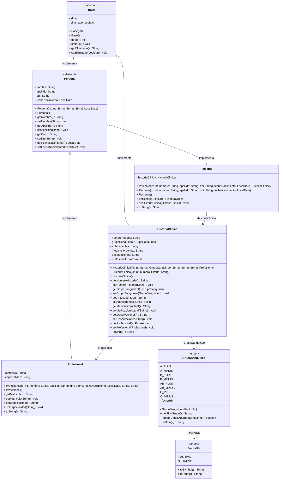

# Trabajo Final Integrador - Sistema de Gestión de Pacientes e Historias Clínicas

      

## Datos del Proyecto

- **Asignatura**: Programación II
- **Dominio**: Paciente → HistoriaClínica (Relación 1→1 unidireccional)

## Integrantes

Este proyecto fue desarrollado de manera colaborativa por el siguiente equipo:

- **Lagos, Alejandro** - [GitHub](https://github.com/Alejandrovans)
- **Lahoz, Cristian** - [GitHub](https://github.com/m415x)
- **Maldonado, Ariana** - [GitHub](https://github.com/AriMaldo19)
- **Ramallo, Gerónimo** - [GitHub](https://github.com/Gerolupo12)

---

## Elección del Dominio y Justificación

Para el desarrollo de este trabajo, se seleccionó el dominio **Paciente → Historia Clínica**.

La elección se fundamenta en la claridad de la relación **1 a 1 unidireccional** que representa: un `Paciente` tiene una y solo una `HistoriaClinica`, y el acceso a la historia clínica se realiza lógicamente a través del paciente. Este dominio es ideal para aplicar los conceptos de la materia, ya que permite modelar objetos complejos, gestionar una lógica de negocio relevante (validaciones de DNI, formatos, etc.) y manejar datos sensibles, lo que hace que la implementación de una arquitectura robusta sea fundamental.

---

## Diseño de la Aplicación

### 1. Diagrama UML

El diseño orientado a objetos de la aplicación se representa en el siguiente diagrama de clases, que sirvió como guía para toda la implementación:

---

### 2. Decisiones Clave de Diseño

El diseño de la aplicación se centró en crear una estructura de código limpia, mantenible y coherente con el patrón DAO/Service, tomando las siguientes decisiones clave:

- **Herencia y Abstracción con la Clase `Persona`**: Para evitar la duplicación de código y modelar la realidad de forma más precisa, se optó por una **clase abstracta `Persona`** de la cual heredan `Paciente` y `Profesional`. Esta decisión de diseño orientado a objetos permite centralizar los atributos y métodos comunes (`nombre`, `apellido`, `dni`, `fechaNacimiento`) en una única superclase, alineándose con los principios de herencia del paradigma.

- **Implementación de la Relación 1→1 Unidireccional**: El requisito principal de una relación 1 a 1 unidireccional se implementó directamente en el modelo de dominio. La clase `Paciente` contiene un atributo de tipo `HistoriaClinica`. Esto cumple estrictamente con la consigna, ya que la navegación es posible solo desde `Paciente` hacia `HistoriaClinica`, pero no en sentido inverso.

- **Uso de `Enum` para Dominios de Valores Fijos (`GrupoSanguineo`)**: Mientras que en la base de datos `GrupoSanguineo` es una tabla para mayor flexibilidad, en el código Java se implementó como un **`Enum`**. Esta decisión prioriza la **seguridad de tipos y la legibilidad del código**. Al usar un `Enum`, el compilador de Java garantiza que solo se puedan asignar valores válidos, previniendo errores en tiempo de ejecución.

---

## Fuentes y Herramientas Utilizadas

- **Lenguaje:** Java 21
- **IDE:** Apache NetBeans
- **Base de Datos:** MySQL 8.0
- **Control de Versiones:** Git y GitHub
- **Asistencia de IA:** Se utilizó Gemini de Google como herramienta de tutoría para validar decisiones de diseño y refinar la sintaxis de código, siguiendo las pautas de uso pedagógico. El chat completo de la interacción se encuentra disponible en [`CHAT IA`](../anexos/chat_ia_pii.pdf).
