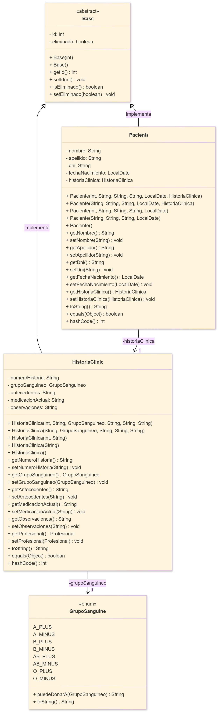
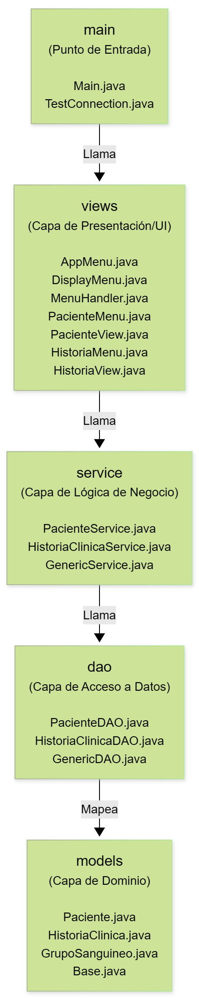
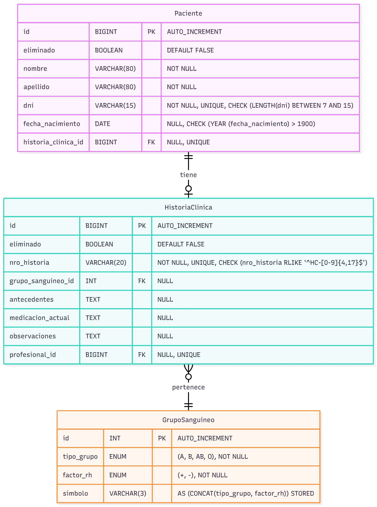

# Trabajo Final Integrador

## Programación II

## Sistema de Gestión de Pacientes e Historias Clínicas

---

### 1. Integrantes y Roles

| Integrante                                                      | Capa(s) a Cargo           | Rol Principal               | Responsabilidades                                                                                                                                      |
| :-------------------------------------------------------------- | :------------------------ | :-------------------------- | :----------------------------------------------------------------------------------------------------------------------------------------------------- |
| **Lahoz, Cristian** - [GitHub](https://github.com/m415x)        | `config`, `models`, `dao` | Arquitectura y Persistencia | Diseño del modelo (M) y la capa de acceso a datos (DAO). Implementación de la persistencia JDBC, consultas SQL y configuración de Gradle.              |
| **Maldonado, Ariana** - [GitHub](https://github.com/AriMaldo19) | `service`, `exceptions`   | Lógica de Negocio           | Implementación de las reglas de negocio (RN) en la capa de servicio. Diseño y creación de excepciones personalizadas (Validation, Duplicate, Service). |
| **Ramallo, Gerónimo**- [GitHub](https://github.com/Gerolupo12)  | `views`, `main`           | Desarrollo de Interfaz (UI) | Implementación de los menús de consola y GUI (JOptionPane). Refactorización a la arquitectura de Vistas (V) y Controladores (C).                       |

---

### 2. Elección del Dominio y Justificación

Para el TPI de Programación 2, se seleccionó el dominio **Paciente → Historia Clínica** .

Esta elección se fundamenta en que representa un caso de uso claro para una **relación 1-a-1 unidireccional**, que era el requisito técnico central de la consigna. La simplificación del dominio (respecto al proyecto de BD1) fue una decisión de diseño intencional para centrar el esfuerzo en los objetivos de P2: la **arquitectura de software** (Vistas, Servicios, DAO), la **gestión de excepciones** y la **correcta implementación de la persistencia con JDBC**.

---

### 3. Diseño

#### Diagrama UML (Modelo de Dominio)

Este diagrama muestra las clases del paquete `models` y sus relaciones, que es el núcleo de la implementación de P2.



#### Patrones y Buenas Prácticas

- **Seguridad (PreparedStatements):** Todas las consultas SQL utilizan `PreparedStatement` para parametrizar las entradas, previniendo vulnerabilidades de Inyección SQL.
- **Baja Lógica (Soft Delete):** Ningún registro se borra físicamente (`DELETE`). Todas las eliminaciones son actualizaciones (`UPDATE ... SET eliminado = TRUE`), preservando el historial y la integridad referencial.
- **Gestión de Recursos (Try-with-Resources):** Todas las conexiones JDBC (`Connection`, `PreparedStatement`, `ResultSet`) se gestionan automáticamente con bloques `try-with-resources` para prevenir la fuga de recursos.
- **Validación Multi-Capa:**
  - **Vista (`views/`):** Valida el formato de entrada (ej: que un ID sea numérico).
  - **Servicio (`service/`):** Valida las reglas de negocio (ej: que un DNI sea único (RN-002) o que una fecha esté en un rango válido).
  - **Base de Datos (`sql/`):** Garantiza la integridad final con `UNIQUE`, `NOT NULL` y `CHECK constraints`.

#### Decisiones de Diseño Clave

El diseño de la base de datos y de la arquitectura de la aplicación se guió por principios de normalización, integridad, escalabilidad y consistencia entre el modelo relacional y el modelo de objetos en Java. A continuación, se detallan las decisiones más importantes tomadas durante el proyecto.

##### A. Implementación de la Relación 1→1 Unidireccional (Requisito TPI)

Para cumplir con el requisito central de P2 de una relación 1→1 unidireccional `Paciente → HistoriaClinica`, se tomó una decisión específica a nivel de base de datos.

- **Implementación:** La relación se implementó en la tabla `Paciente` mediante una clave foránea (`historia_clinica_id`) que apunta a `HistoriaClinica` y, crucialmente, tiene una restricción `UNIQUE`.
- **Justificación:**
  - El `FOREIGN KEY` establece el enlace entre las dos entidades.
  - El `UNIQUE` garantiza que un registro de `HistoriaClinica` solo pueda ser asociado a un único `Paciente`, cumpliendo así la cardinalidad 1 a 1.
  - Se permitió que esta clave foránea sea `NULL`, aportando flexibilidad para poder registrar un paciente antes de que su historia clínica sea creada (HU-001).

##### B. `GrupoSanguineo`: Tabla en la Base de Datos vs. `Enum` en Java

Se tomó una decisión consciente de modelar el grupo sanguíneo de dos maneras distintas en cada capa, optimizando para el contexto de cada una.

- **En la Base de Datos (Tabla):** Se creó una tabla maestra `GrupoSanguineo`. Esto responde a los principios de normalización (BD1), creando una única fuente de verdad (`A_PLUS`, `A_MINUS`, etc.) y usando un `INT` como FK en `HistoriaClinica`.
- **En Java (`Enum`):** En el código Java, se optó por un `Enum` (`GrupoSanguineo.java`). Esta decisión prioriza la **seguridad de tipos** y la legibilidad del código (P2). El `Enum` asegura que solo se puedan usar valores válidos en tiempo de compilación. El DAO (`HistoriaClinicaDAO`) es responsable de traducir entre el ID de la tabla y el `Enum`.

##### C. Simplificación del Dominio (P2 vs. BD1)

Aunque el proyecto de la materia Bases de Datos I incluía entidades adicionales como `Persona` y `Profesional`, para este TPI de Programación II se decidió simplificar el modelo a las dos entidades centrales: `Paciente` y `HistoriaClinica`.

- **Justificación:** Esta simplificación fue intencional para centrar el esfuerzo en los objetivos de P2: la **arquitectura de software**. El foco del proyecto no es la complejidad del DER, sino la correcta implementación de las capas `views`, `service` y `dao`, la gestión de la persistencia con JDBC, y el manejo de transacciones y reglas de negocio.

##### D. Arquitectura de Vistas (Refactorización)

Para mejorar la legibilidad y escalabilidad, el proyecto fue refactorizado de un `MenuHandler` monolítico a un paquete `views/` desacoplado, siguiendo el Principio de Responsabilidad Única.

- **`AppMenu` / `MainGUI`:** Orquestadores que inyectan las dependencias.
- **`MenuHandler`:** Controlador "Router" que delega al sub-menú correspondiente.
- **`PacienteMenu` / `HistoriaMenu`:** Sub-Controladores que orquestan la lógica de la UI (llaman al Servicio y a la Vista).
- **`PacienteView` / `HistoriaView`:** Vistas "Tontas" que solo imprimen/leen de la consola o `JOptionPane`.

---

### 4. Arquitectura por Capas y Responsabilidades de Cada Paquete

#### Arquitectura en Capas

El proyecto está organizado en una arquitectura de 4 capas, siguiendo las mejores prácticas y los requisitos del TPI. La refactorización ha movido toda la lógica de UI al paquete `views/`.



#### Estructura General

```plaintext
paciente-historia-cliente
├── sql                                             # scripts SQL
│   ├── db_1
│   └── programacion_2
│       ├── 01_esquema.sql                          ← script para crear el esquema de la BD
│       ├── 02_catalogos.sql                        ← script para poblar tablas de catálogo
│       └── 03_carga_masiva.sql                     ← scripts para poblar la BD con datos de
└── src                                             # código fuente del proyecto
    └── main                                        # código fuente principal
        ├── java                                    # paquetes Java
        │   ├── config                              # configuración de conexión y transacciones
        │   │   ├── DatabaseConnection.java         ← utilitario para conexión a BD
        │   │   └── TransactionManager.java         ← utilitario para manejo de transacciones
        │   ├── dao                                 # acceso a datos (JDBC)
        │   │   ├── GenericDAO.java                 ← DAO genérico para entidades
        │   │   ├── HistoriaClinicaDAO.java         ← DAO específico para historias clínicas
        │   │   └── PacienteDAO.java                ← DAO específico para pacientes
        │   ├── exceptions                          # excepciones personalizadas
        │   │   ├── DuplicateEntityException.java   ← excepción para entidades duplicadas
        │   │   ├── ServiceException.java           ← excepción genérica para servicios
        │   │   └── ValidationException.java        ← excepción para validaciones de datos
        │   ├── main                                # punto de entrada de la aplicación
        │   │   ├── Main.java                       ← clase principal para ejecutar la aplicación
        │   │   └── TestConnection.java             ← clase para probar conexión a BD
        │   ├── models                              # entidades del dominio
        │   │   ├── Base.java                       ← clase base para entidades con id y eliminado
        │   │   ├── GrupoSanguineo.java             ← modelo de dominio GrupoSanguineo
        │   │   ├── HistoriaClinica.java            ← modelo de dominio HistoriaClínica
        │   │   └── Paciente.java                   ← modelo de dominio Paciente
        │   ├── service                             # lógica de negocio y validaciones
        │   │   ├── GenericService.java             ← servicio genérico para entidades
        │   │   ├── HistoriaClinicaService.java     ← servicio específico para historias clínicas
        │   │   └── PacienteService.java            ← servicio específico para pacientes
        │   ├── test                                # pruebas manuales
        │   │   └── ServiceTest.java                ← pruebas para servicios
        │   └── views                               # capa de presentación (menús por entidad)
        │       ├── gui                             # interfaz gráfica (JOptionPane)
        │       │   ├── HistoriaGUI.java            ← submenú específico para historias clínicas
        │       │   ├── MainGUI.java                ← punto de entrada de la interfaz gráfica
        │       │   └── PacienteGUI.java            ← submenú específico para pacientes
        │       ├── historias                       # submenús de Historias Clínicas
        │       │   ├── HistoriaMenu.java           ← submenú específico para historias clínicas
        │       │   └── HistoriaView.java           ← muestra o captura datos de historia clínica
        │       ├── pacientes                       # submenús de Pacientes
        │       │   ├── PacienteMenu.java           ← submenú específico para pacientes
        │       │   └── PacienteView.java           ← muestra o captura datos de paciente
        │       ├── AppMenu.java                    ← menú principal con opciones
        │       ├── DisplayMenu.java                ← utilitario para imprimir opciones
        │       └── MenuHandler.java                ← controlador de menú
        └── resources                               # archivos de configuración
            ├── db.properties                       ← archivo de configuración de conexión a BD
            └── db.properties.example               ← plantilla de configuración de conexión a BD
```

#### Capas

**`views` (Capa de Presentación)**

Responsable de la interacción con el usuario (consola o GUI). Llama a la capa de Servicio. No contiene lógica de negocio.

**`service` (Capa de Lógica de Negocio)**

El "cerebro" de la aplicación. Responsable de:

- **Validación:** Aplicar Reglas de Negocio (RN) (ej: formato DNI, fechas, unicidad).
- **Orquestación:** Coordinar operaciones entre DAOs (ej: `delete` de Paciente llama a `delete` de HC).
- **Transacciones:** (Ver punto 5).

**`dao` (Capa de Acceso a Datos)**

Responsabilidad única de hablar con la BD. Contiene el código JDBC, `PreparedStatement` y las consultas SQL. Traduce `ResultSet` a objetos `models`.

**`models` (Capa de Dominio):**

Define las entidades (POJOs) del sistema (`Paciente`, `HistoriaClinica`). No contiene validaciones ni lógica de negocio.

**`exceptions`**

Paquete de excepciones personalizadas (`ValidationException`, `DuplicateEntityException`, `ServiceException`) para un manejo de errores robusto, como se solicita en las pautas.

---

### 5. Persistencia y Transacciones

#### Diagrama Entidad Relación (DER)

Este DER representa el esquema implementado en la base de datos MySQL, simplificado para P2.



#### Orden de Operaciones y Transacciones

La capa de servicio (`PacienteService`) orquesta las operaciones para mantener la integridad:

- **`INSERT` (HU-001):**

  1. `historiaClinicaService.insert(hc)` (Se inserta B, se obtiene su ID).
  2. `paciente.setHistoriaClinica(hc)`.
  3. `pacienteDAO.insert(paciente)` (Se inserta A con la FK de B).

- **`DELETE` (HU-004 / RN-013):**

  1. `Paciente p = pacienteDAO.selectById(id, false)` (Se busca al paciente activo).
  2. `historiaClinicaService.delete(p.getHistoriaClinica().getId())` (Se elimina B).
  3. `pacienteDAO.delete(id)` (Se elimina A).

- **`RECOVER` (HU-010 / RN-031):**

  1. `Paciente p = pacienteDAO.selectDeletedById(id)` (Se busca al paciente eliminado).
  2. `historiaClinicaService.recover(p.getHistoriaClinica().getId())` (Se recupera B).
  3. `pacienteDAO.recover(id)` (Se recupera A).

- **`DELETE SEGURO` (HU-008):**

  1. `Paciente p = pacienteDAO.selectById(id, false)`.
  2. `p.setHistoriaClinica(null)`.
  3. `pacienteDAO.update(p)` (Se setea `historia_clinica_id = NULL`).
  4. `historiaClinicaService.delete(hcId)` (Se elimina B sin dejar huérfanos).

#### Demostración de Transacción y Rollback

Para cumplir con el requisito de "demostrar el rollback con un fallo simulado", se creó un método de prueba `handleTestRollback()`.

1. **Flujo:** Se intenta llamar a `pacienteService.insert()` con un `Paciente` **válido** pero una `HistoriaClinica` **inválida** (ej: `nroHistoria = "HC-123"`, que viola la RN-017).
2. **Acción:** `pacienteService.insert()` llama a `historiaClinicaService.insert()`.
3. **Fallo:** `historiaClinicaService` lanza una `ValidationException` al validar el formato de "HC-123".
4. **Resultado (Rollback):** La excepción interrumpe `pacienteService.insert()` **antes** de que `pacienteDAO.insert()` sea llamado.
5. **Verificación:** El Paciente (que era válido) no se persiste en la BD. La transacción se revierte a nivel de servicio, demostrando la atomicidad.

---

### 6. Validaciones y Reglas de Negocio

Las reglas se implementan en las clases del paquete `service` y se comunican a la vista mediante excepciones personalizadas (`exceptions`).

- **`ValidationException`**: Errores de datos de entrada (campos vacíos, formatos regex, rangos de fecha).
  - (RN-001.6) DNI: `^[0-9]{7,15}$`
  - (RN-001.7) Fecha Nacimiento: Entre 1900 y `LocalDate.now()`.
  - (RN-017) Nro. Historia: `^HC-[0-9]{4,17}$`
- **`DuplicateEntityException`**: Violaciones de unicidad.
  - (RN-002) DNI: `pacienteService.validateDniUnique()`
  - (RN-015) Nro. Historia: `historiaClinicaService.validateNroHistoriaUnique()`
- **`ServiceException`**: Errores de sistema (ej: `SQLException` del DAO).

---

### 7. Pruebas Realizadas

Las pruebas se realizaron de dos maneras:

1. **Pruebas Funcionales (Manuales):** Se ejecutó la aplicación (tanto en Consola como en GUI) y se probaron todas las opciones del menú (1 al 11). Se tomaron capturas de pantalla de los "casos borde" (DNI duplicado, ID inexistente, formato inválido, etc.).
2. **Pruebas de Lógica (Automatizadas):** Se utilizó la clase `ServiceTest.java` para verificar la capa de servicio _antes_ de la implementación de la UI.
   - `TEST 1: Inserción VÁLIDA` → OK.
   - `TEST 2: DNI DUPLICADO` → OK (Lanza `DuplicateEntityException`).
   - `TEST 3: DNI INVÁLIDO` → OK (Lanza `ValidationException`).
   - `TEST 4: Fecha demasiado antigua` → OK (Lanza `ValidationException`).
   - `TEST 5: Rollback transaccional` → OK (Lanza `ValidationException` por HC, no inserta Paciente).

[_Ver Anexo de Capturas de Pantalla_](../anexos/programacion_2/capturas-pantalla.md)

---

### 8. Conclusiones y Mejoras Futuras

El TPI permitió implementar con éxito una arquitectura Java de 4 capas, cumpliendo todos los requisitos de P2 (DAO, Service, JDBC, 1-a-1). La refactorización a Gradle y a una capa de `views` desacoplada (con modos Consola y GUI) demuestra un diseño robusto y escalable.
Cada integrante cumplió un rol esencial, logrando un sistema modular, seguro y escalable.

**Posibles Mejoras:**

- Implementar `TransactionManager` explícito para que las operaciones (ej: HU-001) sean 100% atómicas a nivel de BD (actualmente son atómicas a nivel de Servicio).
- Completar la implementación de JUnit con mocks (Mockito) en lugar de un `ServiceTest.java` manual.
- Migrar la UI a un framework completo (JavaFX o Spring Boot + React).

---

### 9. Fuentes y Herramientas Utilizadas

- **IDE:** Apache NetBeans 21
- **Lenguaje:** Java 21
- **Build Tool:** Gradle 8+
- **Wrapper:** Gradle (Wrapper)
- **Base de Datos:** MySQL 8.4
- **Control de Versiones:** Git, GitHub
- **IA Asistida:** Se utilizó ChatGPT y Gemini como asistentes de depuración y para la generación y refactorización de docu

---

### 10. Enlaces

- [Enlace al Repositorio GitHub](https://github.com/Gerolupo12/paciente-historia-cliente)

- [Enlace al Video de Demostración](youtube.com)
